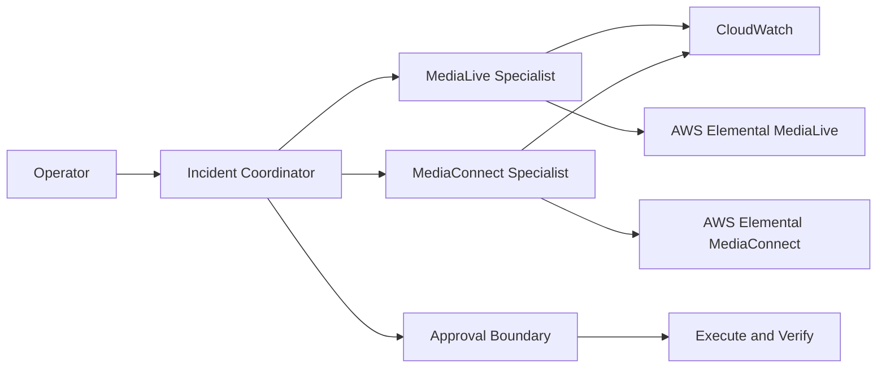

# Agentic IOPS Development Guidelines

These guidelines define the target engineering standard for Agentic Intelligent Media Operations, with special focus on the refactored `media-services-langchain`.

The objective is not merely clean code. The objective is a codebase that makes the correct change obvious, keeps every change small, protects operational safety, and lets a new contributor understand the system without reconstructing it mentally.

## The Standard

The refactored version is the same service, organized by what each piece talks to.

Every file is:

- short;
- named for what it does;
- responsible for exactly one thing;
- explicit about the layer it belongs to;
- replaceable without rewriting unrelated layers;
- testable without deploying to AWS.

The codebase MUST optimize for:

1. Small, reviewable changes.
2. Action-oriented names.
3. Explicit boundaries.
4. Typed data between layers.
5. Enforced operational safety.
6. Deterministic tests.
7. Obvious extension points.

---

## 1. Names Are a Forcing Function

A vague name permits vague scope. A precise name forces a small responsibility.

Name files and functions after the action they perform or the boundary they cross.

### Use action-oriented file names

Prefer:

```text
classify_request.py
plan_investigation.py
request_action_approval.py
dispatch_ready_tasks.py
merge_specialist_findings.py
verify_channel_stopped.py
invoke_specialist_runtime.py
load_incident_memory.py
record_incident_event.py
list_media_live_channels.py
stop_media_connect_flow.py
```

Avoid:

```text
manager.py
service.py
processor.py
handler.py
helper.py
helpers.py
utils.py
common.py
misc.py
core.py
base.py
tools.py
prompts.py
nodes.py
```

Names such as `handler.py` are acceptable only when qualified by the exact event:

```text
handle_agentcore_invocation.py
handle_cloudwatch_alarm.py
```

### Name functions with a verb and an object

Prefer:

```python
classify_request()
discover_signal_path()
collect_channel_metrics()
approve_remediation()
stop_channel()
verify_channel_state()
```

Avoid:

```python
process()
execute()
run()
handle()
do_work()
manage()
```

### Split names containing “and”

A name containing `and`, `or`, or multiple unrelated nouns usually exposes more than one responsibility.

Avoid:

```text
classify_and_plan.py
invoke_and_merge.py
memory_and_observability.py
channel_flow_manager.py
```

Split them:

```text
classify_request.py
plan_investigation.py
invoke_specialist.py
merge_findings.py
load_memory.py
record_trace.py
```

### Name abstractions after behavior

Interfaces and protocols describe capabilities, not implementations.

Prefer:

```python
class InvokeSpecialist(Protocol): ...
class LoadIncidentMemory(Protocol): ...
class ControlMediaLiveChannel(Protocol): ...
class ReadMediaConnectHealth(Protocol): ...
```

Avoid:

```python
class RuntimeClientBase: ...
class AbstractManager: ...
class GenericService: ...
```

### Naming review question

Before creating a file, complete this sentence:

> This file exists to ______.

The answer MUST be one short action. If the answer needs “and,” split the file.

---

## 2. Small Files, Small Units

Small units reduce coupling, shorten reviews, improve agent navigation, and make ownership clear.

### Size budgets

These are design budgets, not targets to fill:

| Unit | Preferred | Review required |
|---|---:|---:|
| Production file | 40–150 lines | Over 250 lines |
| Function | 5–25 lines | Over 40 lines |
| Class | 20–100 lines | Over 150 lines |
| Test file | 50–200 lines | Over 300 lines |
| Prompt file | One prompt purpose | Multiple agent roles |
| Public function parameters | 0–4 | More than 5 |

Generated code, declarative infrastructure, and static schemas may exceed these budgets when splitting would reduce clarity.

### One reason to change

A file MUST have one primary reason to change.

For example:

- `classify_request.py` changes when classification behavior changes.
- `invoke_specialist_runtime.py` changes when the AgentCore invocation boundary changes.
- `stop_media_live_channel.py` changes when MediaLive stop behavior changes.
- `require_action_approval.py` changes when authorization policy changes.

Those concerns MUST NOT share a file.

### Keep orchestration readable

Workflow code should read like the operational process:

```python
classification = classify_request(request)
topology = discover_signal_path(classification)
plan = plan_investigation(request, topology)
findings = dispatch_ready_tasks(plan)
proposal = propose_remediation(findings)
approval = request_action_approval(proposal)
result = apply_approved_action(approval)
return verify_remediation(result)
```

Each called action belongs in its own focused module.

### Do not fragment cohesive logic

Small files do not mean one trivial wrapper per line of code.

Keep logic together when it:

- changes for the same reason;
- uses the same domain vocabulary;
- is always tested as one behavior;
- has no meaningful independent boundary.

Split by responsibility, not by line count alone.

---

## 3. Put Indirection Between Layers

Frameworks, AWS SDKs, and remote runtimes are volatile boundaries. Domain and workflow code MUST NOT depend on them directly.

Use thin shims between layers:

```text
Entrypoint → Application workflow → Port → Adapter → External system
```

Example:

```text
AgentCore request
  → handle_coordinator_invocation.py
  → coordinate_incident.py
  → InvokeSpecialist protocol
  → invoke_agentcore_specialist.py
  → Bedrock AgentCore Runtime
```

### Entrypoints talk to transport frameworks

Entrypoints may import:

- AgentCore runtime APIs;
- FastAPI;
- MCP server APIs;
- request/response transport schemas;
- dependency wiring.

Entrypoints MUST NOT:

- decide which specialist to call;
- contain prompts;
- implement AWS media operations;
- contain incident policy;
- perform result synthesis.

### Application workflows talk to ports

Application workflows coordinate domain behavior.

They may import:

- domain models;
- domain policies;
- port protocols;
- workflow-local actions.

They MUST NOT import:

- `boto3`;
- AgentCore SDK classes;
- MediaLive or MediaConnect SDK clients;
- FastAPI or MCP;
- CDK;
- framework-specific request objects.

### Ports describe what the application needs

A port is a small protocol owned by the application, not by the external SDK.

```python
from typing import Protocol

from domain.incidents.incident_task import IncidentTask
from domain.incidents.specialist_finding import SpecialistFinding


class InvokeSpecialist(Protocol):
    async def invoke_specialist(
        self,
        task: IncidentTask,
    ) -> SpecialistFinding:
        ...
```

Ports MUST:

- use domain types;
- expose one cohesive capability;
- hide transport details;
- be easy to fake in tests.

### Adapters talk to external systems

Adapters may import:

- `boto3`;
- LangChain or LangGraph integration packages;
- AgentCore SDKs;
- MediaLive and MediaConnect clients;
- CloudWatch;
- external database clients.

Adapters MUST:

- translate domain input into external requests;
- translate external responses into domain output;
- set explicit timeouts;
- classify external failures;
- avoid business-policy decisions;
- avoid returning raw SDK dictionaries outside the adapter.

### Domain code talks only to domain code

Domain code contains:

- incident state;
- tasks;
- evidence;
- hypotheses;
- approval decisions;
- operational risk;
- remediation proposals;
- media topology.

Domain code MUST remain importable without AWS, LangChain, LangGraph, AgentCore, FastAPI, or MCP installed.

### Shims are intentionally boring

A good shim is thin and unsurprising. It translates, invokes, and returns.

Do not hide orchestration or policy in an adapter. Do not create indirection merely to rename an SDK method.

Create a shim when it provides at least one of:

- dependency inversion;
- domain-type translation;
- error normalization;
- safety enforcement;
- observability;
- test substitution;
- provider portability.

---

## 4. Enforce One-Way Dependencies

Dependencies MUST flow inward:

```text
entrypoints
    ↓
workflows
    ↓
domain

adapters → ports ← workflows
```

Allowed dependency directions:

| From | May depend on |
|---|---|
| `domain/` | `domain/` |
| `ports/` | `domain/`, standard library typing |
| `workflows/` | `domain/`, `ports/`, workflow-local actions |
| `adapters/` | `domain/`, `ports/`, external SDKs |
| `entrypoints/` | workflows, adapters, transport frameworks |
| `bootstrap/` | all layers for dependency construction only |

Forbidden dependency directions:

- Domain importing adapters.
- Domain importing frameworks.
- Workflows importing `boto3`.
- MediaLive adapters importing MediaConnect adapters.
- Specialists importing coordinator internals.
- Tests importing another test's private helpers.
- CDK code defining application behavior.

### No cross-specialist reach-through

The coordinator talks to specialist ports.

MediaLive and MediaConnect specialists MUST NOT import each other. Cross-service reasoning belongs in the coordinator workflow or domain topology model.

---

## 5. Recommended Refactored Project Layout

The target layout organizes the same service by responsibility and by the external system each adapter talks to.

```text
media-services-langchain/
├── pyproject.toml
├── README.md
├── Makefile
├── .env.example
│
├── src/
│   └── media_iops/
│       ├── domain/
│       │   ├── incidents/
│       │   │   ├── incident.py
│       │   │   ├── incident_status.py
│       │   │   ├── incident_task.py
│       │   │   ├── specialist_finding.py
│       │   │   ├── remediation_proposal.py
│       │   │   └── verification_result.py
│       │   ├── topology/
│       │   │   ├── live_event.py
│       │   │   ├── media_resource.py
│       │   │   ├── signal_path.py
│       │   │   └── connect_resources.py
│       │   └── safety/
│       │       ├── action_risk.py
│       │       ├── action_approval.py
│       │       └── require_action_approval.py
│       │
│       ├── ports/
│       │   ├── invoke_specialist.py
│       │   ├── load_incident_memory.py
│       │   ├── save_incident_memory.py
│       │   ├── read_media_live.py
│       │   ├── control_media_live.py
│       │   ├── read_media_connect.py
│       │   ├── control_media_connect.py
│       │   ├── read_cloudwatch.py
│       │   └── record_telemetry.py
│       │
│       ├── workflows/
│       │   ├── coordinate_incident/
│       │   │   ├── build_incident_graph.py
│       │   │   ├── classify_request.py
│       │   │   ├── discover_signal_path.py
│       │   │   ├── plan_investigation.py
│       │   │   ├── request_action_approval.py
│       │   │   ├── dispatch_ready_tasks.py
│       │   │   ├── merge_specialist_findings.py
│       │   │   ├── propose_remediation.py
│       │   │   ├── apply_approved_action.py
│       │   │   ├── verify_remediation.py
│       │   │   └── write_incident_response.py
│       │   ├── inspect_media_live/
│       │   │   ├── build_media_live_graph.py
│       │   │   ├── inspect_channel.py
│       │   │   ├── collect_channel_metrics.py
│       │   │   ├── collect_channel_logs.py
│       │   │   └── identify_channel_issues.py
│       │   └── inspect_media_connect/
│       │       ├── build_media_connect_graph.py
│       │       ├── inspect_flow.py
│       │       ├── collect_flow_metrics.py
│       │       ├── inspect_flow_thumbnail.py
│       │       └── identify_flow_issues.py
│       │
│       ├── prompts/
│       │   ├── classify_request_prompt.py
│       │   ├── plan_investigation_prompt.py
│       │   ├── propose_remediation_prompt.py
│       │   ├── write_incident_response_prompt.py
│       │   ├── inspect_media_live_prompt.py
│       │   └── inspect_media_connect_prompt.py
│       │
│       ├── adapters/
│       │   ├── agentcore/
│       │   │   ├── invoke_specialist_runtime.py
│       │   │   ├── load_agentcore_memory.py
│       │   │   ├── save_agentcore_memory.py
│       │   │   └── translate_runtime_response.py
│       │   ├── bedrock/
│       │   │   ├── create_chat_model.py
│       │   │   └── classify_model_failure.py
│       │   ├── cloudwatch/
│       │   │   ├── read_channel_metrics.py
│       │   │   ├── read_channel_logs.py
│       │   │   └── read_flow_metrics.py
│       │   ├── media_live/
│       │   │   ├── list_channels.py
│       │   │   ├── describe_channel.py
│       │   │   ├── start_channel.py
│       │   │   ├── stop_channel.py
│       │   │   ├── describe_schedule.py
│       │   │   └── switch_channel_input.py
│       │   ├── media_connect/
│       │   │   ├── list_flows.py
│       │   │   ├── describe_flow.py
│       │   │   ├── start_flow.py
│       │   │   ├── stop_flow.py
│       │   │   └── inspect_flow_thumbnail.py
│       │   └── telemetry/
│       │       ├── record_workflow_span.py
│       │       ├── record_tool_call.py
│       │       └── redact_sensitive_attributes.py
│       │
│       ├── entrypoints/
│       │   └── agentcore/
│       │       ├── handle_coordinator_invocation.py
│       │       ├── handle_media_live_invocation.py
│       │       └── handle_media_connect_invocation.py
│       │
│       ├── bootstrap/
│       │   ├── build_coordinator_runtime.py
│       │   ├── build_media_live_runtime.py
│       │   └── build_media_connect_runtime.py
│       │
│       └── settings/
│           ├── load_runtime_settings.py
│           └── runtime_settings.py
│
├── tests/
│   ├── unit/
│   │   ├── domain/
│   │   ├── workflows/
│   │   └── adapters/
│   ├── contract/
│   │   ├── verify_specialist_contract.py
│   │   ├── verify_approval_contract.py
│   │   └── verify_stream_event_contract.py
│   ├── scenarios/
│   │   ├── diagnose_input_loss/
│   │   ├── diagnose_transport_loss/
│   │   └── reject_unapproved_stop/
│   └── integration/
│       ├── invoke_deployed_coordinator.py
│       └── verify_approved_channel_stop.py
│
├── fixtures/
│   ├── topologies/
│   ├── incidents/
│   └── tool_responses/
│
└── infrastructure/
    └── cdk/
        ├── bin/
        └── stacks/
```

### Layout intent

- `domain/` knows the business vocabulary.
- `ports/` says what the workflows need.
- `workflows/` performs user-visible operations.
- `prompts/` contains one prompt purpose per file.
- `adapters/` are grouped by the system they talk to.
- `entrypoints/` translate incoming transport requests.
- `bootstrap/` constructs dependencies and runtimes.
- `settings/` validates configuration.
- `tests/` mirror production boundaries.
- `fixtures/` make offline incident replay possible.
- `infrastructure/` deploys the service but does not define its behavior.

---

## 6. Current-to-Target File Mapping

Use this map to refactor incrementally without changing behavior.

| Current file | Target responsibility |
|---|---|
| `coordinator/main.py` | `entrypoints/agentcore/handle_coordinator_invocation.py` plus `bootstrap/build_coordinator_runtime.py` |
| `coordinator/graph.py` | `workflows/coordinate_incident/build_incident_graph.py` |
| `coordinator/nodes/classify.py` | `workflows/coordinate_incident/classify_request.py` |
| `coordinator/nodes/plan.py` | `workflows/coordinate_incident/plan_investigation.py` |
| `coordinator/nodes/approve.py` | `workflows/coordinate_incident/request_action_approval.py` |
| `coordinator/nodes/route.py` | `workflows/coordinate_incident/dispatch_ready_tasks.py` |
| `coordinator/nodes/merge.py` | `workflows/coordinate_incident/merge_specialist_findings.py` |
| `coordinator/nodes/respond.py` | `workflows/coordinate_incident/write_incident_response.py` |
| `coordinator/prompts.py` | One file per prompt under `prompts/` |
| `shared/state.py` | Typed models under `domain/incidents/` |
| `shared/runtime_client.py` | `adapters/agentcore/invoke_specialist_runtime.py` |
| `shared/memory.py` | Separate load/save adapters under `adapters/agentcore/` |
| `shared/observability.py` | Focused adapters under `adapters/telemetry/` |
| `shared/config.py` | `settings/runtime_settings.py` and `settings/load_runtime_settings.py` |
| `eml/tools.py` | One action per adapter under `adapters/media_live/` and `adapters/cloudwatch/` |
| `emx/tools.py` | One action per adapter under `adapters/media_connect/` and `adapters/cloudwatch/` |
| `eml/main.py` | `entrypoints/agentcore/handle_media_live_invocation.py` |
| `emx/main.py` | `entrypoints/agentcore/handle_media_connect_invocation.py` |

Refactors MUST keep compatibility shims at old import locations until callers and tests migrate.

Example:

```python
# shared/runtime_client.py
"""Compatibility shim. Remove after all callers migrate."""

from media_iops.adapters.agentcore.invoke_specialist_runtime import (
    AgentCoreSpecialistInvoker as AgentCoreRuntimeClient,
)

__all__ = ["AgentCoreRuntimeClient"]
```

Compatibility shims MUST:

- contain no new behavior;
- point to the removal issue or migration milestone;
- emit deprecation warnings only when they will not corrupt runtime output;
- be removed after all callers migrate.

---

## 7. Model Data Explicitly

Do not pass untyped dictionaries or JSON strings between internal layers.

### External data uses validated boundary models

Use Pydantic models for:

- runtime payloads;
- API requests and responses;
- tool arguments;
- environment settings;
- external event payloads;
- serialized checkpoints.

### Internal domain data uses focused types

Use frozen dataclasses, enums, or small Pydantic models for:

- incident IDs;
- resource identities;
- evidence;
- task status;
- action risk;
- approvals;
- remediation proposals;
- verification results.

Prefer:

```python
finding = SpecialistFinding(
    source=Specialist.MEDIA_LIVE,
    summary="Input loss detected",
    evidence=evidence,
    confidence=Confidence.HIGH,
)
```

Avoid:

```python
finding = {
    "agent": "eml",
    "result": "Input loss detected",
    "confidence": "probably high",
}
```

### Return structured results from tools

Internal tools MUST return typed results. Convert to JSON or text only at transport boundaries.

Never require another model call merely to recover structure from a string generated by a tool.

---

## 8. Separate Decisions from Effects

The system makes decisions and performs effects. These must be independently testable.

Decision examples:

- classify intent;
- calculate action risk;
- choose the next investigation task;
- decide whether evidence supports a hypothesis;
- determine whether approval is required.

Effect examples:

- invoke a model;
- call MediaLive;
- call MediaConnect;
- read CloudWatch;
- persist memory;
- emit telemetry.

Decision modules MUST be testable with plain inputs and no network access.

Effect modules MUST be replaceable by deterministic fakes.

---

## 9. Operational Safety Is Code, Not Prompt Text

Prompt instructions improve behavior but do not enforce authorization.

Every write operation MUST pass through an action-policy boundary.

```text
Proposed action
  → classify risk
  → bind approval to exact action and resource
  → validate approval
  → perform action
  → verify result
```

### Required controls

- Read and write ports MUST be separate.
- Write adapters MUST require an approved action object.
- Approval MUST bind actor, resource, action, parameters, and expiry.
- Specialists MUST NOT accept unvalidated free-text permission.
- Direct specialist invocation MUST NOT bypass authorization.
- Every mutation MUST be idempotent or carry an idempotency key.
- Every mutation MUST capture before and after state.
- Every mutation MUST have a verification action.
- Logs and tool results MUST be treated as untrusted input.

### Never expose a raw write client

Avoid:

```python
media_live_client.stop_channel(ChannelId=channel_id)
```

outside the focused write adapter.

Prefer:

```python
await stop_media_live_channel(
    approved_action=approved_action,
    channel_control=channel_control,
)
```

---

## 10. Handle Failures Deliberately

Do not reduce all failures to `str(exception)`.

Classify failures into a small, stable taxonomy:

```text
InvalidRequest
ResourceNotFound
PermissionDenied
ApprovalRequired
ApprovalExpired
ExternalServiceUnavailable
ExternalServiceThrottled
SpecialistTimedOut
MalformedSpecialistResponse
VerificationFailed
UnexpectedFailure
```

### Exception rules

- Catch only failures the current layer can translate or recover from.
- Broad `except Exception` is allowed only at entrypoint and worker boundaries.
- Boundary catches MUST preserve the original exception as the cause.
- User-facing errors MUST include a safe next action.
- Logs MUST include correlation IDs without exposing credentials or sensitive payloads.

### Retry rules

Retry only when:

- the operation is safe to retry;
- the failure is transient;
- the retry count is bounded;
- exponential backoff and jitter are configured;
- the overall task deadline has not expired.

Never retry:

- invalid input;
- permission denial;
- rejected approval;
- non-idempotent mutation without an idempotency key.

---

## 11. Prompts Are Versioned Application Components

Prompts MUST be small, role-specific, and testable.

### Prompt rules

- One prompt purpose per file.
- Keep capability schemas in tool definitions, not duplicated in prompts.
- Keep policy enforcement in code.
- Use explicit output schemas.
- Include uncertainty behavior.
- Require evidence for operational conclusions.
- Do not ask the model to infer secrets, permissions, or approval.
- Track prompt version in traces and evaluation results.

Avoid a shared `prompts.py` containing unrelated coordinator and specialist prompts.

Prefer:

```text
prompts/
├── classify_request_prompt.py
├── plan_investigation_prompt.py
├── propose_remediation_prompt.py
└── write_incident_response_prompt.py
```

---

## 12. Build Observable Workflows

Observability must explain the incident workflow, not merely show model calls.

### Required identifiers

Every trace and structured log MUST include, where applicable:

- `incident.id`
- `session.id`
- `actor.id`
- `task.id`
- `resource.id`
- `workflow.name`
- `workflow.version`
- `prompt.version`
- `specialist.name`
- `tool.name`
- `action.risk`
- `approval.id`

### Required workflow events

Emit typed events for:

```text
incident_started
topology_discovered
plan_created
task_started
tool_called
evidence_collected
hypothesis_updated
approval_requested
approval_received
action_started
action_completed
verification_completed
incident_completed
incident_failed
```

Telemetry adapters MUST redact secrets and avoid recording raw prompts, logs, or tool output by default.

---

## 13. Tests Mirror the Architecture

Tests should make architectural violations uncomfortable.

### Unit tests

Test one decision or transformation:

```text
test_classify_request_routes_channel_question.py
test_plan_investigation_orders_upstream_checks_first.py
test_require_action_approval_rejects_expired_approval.py
test_verify_remediation_reports_unchanged_state.py
```

Use behavior-oriented test names:

```python
def test_stop_channel_rejects_approval_for_another_channel():
    ...
```

Avoid:

```python
def test_stop():
    ...
```

### Contract tests

Every adapter implementing a port MUST pass the same contract suite as its fake.

Contract tests validate:

- input and output types;
- error translation;
- timeouts;
- idempotency;
- authorization requirements;
- safe serialization.

### Scenario tests

Scenario tests replay complete incidents with deterministic fakes.

They MUST assert:

- selected resources;
- task order and dependencies;
- tool calls;
- evidence used;
- approval behavior;
- proposed action;
- verification outcome;
- final customer-facing summary.

### Live integration tests

Live tests are reserved for external-system compatibility. They MUST NOT be the first place core workflow behavior is tested.

---

## 14. Refactor in Thin Vertical Slices

Do not reorganize the entire service in one pull request.

Each refactor slice MUST:

1. Preserve externally visible behavior.
2. Move one responsibility.
3. Add or preserve tests.
4. Leave a compatibility shim when necessary.
5. Avoid unrelated formatting or naming changes.
6. End with all tests passing.

Recommended sequence:

1. Introduce domain task and finding types.
2. Extract the specialist invocation port.
3. Move AgentCore invocation into an adapter.
4. Move coordinator nodes into action-named workflow modules.
5. Split prompts by purpose.
6. Split MediaLive tools by action.
7. Split MediaConnect tools by action.
8. Introduce enforced approval types and write ports.
9. Add verification actions.
10. Move entrypoint wiring into bootstrap modules.

---

## 15. Code Quality Rules

### Python

- Use Python type hints for every public function.
- Prefer `async` only for actual concurrent or non-blocking work.
- Use keyword arguments at external boundaries.
- Use enums instead of free-form status strings.
- Use `pathlib.Path` instead of manual path concatenation.
- Use timezone-aware datetimes.
- Inject clocks and ID generators when behavior depends on them.
- Keep module-level initialization free of network calls.
- Avoid mutable global state.
- Avoid boolean arguments that change function purpose.
- Prefer composition over inheritance.

### Configuration

- Validate settings once at startup.
- Fail fast with a precise missing-setting message.
- Do not read environment variables throughout business logic.
- Pass a typed settings object during bootstrap.
- Keep provider-specific configuration in its adapter.

### Comments and documentation

Comments explain why, constraints, or non-obvious tradeoffs.

Do not narrate obvious code:

```python
# Increment retry count
retry_count += 1
```

Document:

- operational safety assumptions;
- retry and timeout choices;
- compatibility constraints;
- domain terms;
- reasons for unusual indirection.

### Imports

- Do not use wildcard imports.
- Do not manipulate `sys.path`.
- Do not depend on container-specific copied directory layouts.
- Package shared code and import it through stable package names.

---

## 16. Documentation Is Mandatory

Documentation is part of the implementation. A change is not complete when the
code works but the documented path is missing, stale, ambiguous, or untested.

### The README is the entry point

The README MUST get someone from:

> “I just cloned this.”

to:

> “It is running.”

without requiring them to read source code.

The README is not an architecture archive or a changelog. Keep it focused on
the shortest successful user journey, then link to supporting documents for
deeper material.

### Mandatory README sections

Every runnable sample MUST contain these sections, in this order.

#### 1. Purpose

Explain:

- what the project does;
- what customer or operator problem it solves;
- who should use the sample;
- the successful outcome the user will see.

The opening MUST describe user value before frameworks and AWS services.

Prefer:

> Investigate a live-video incident across transport and encoding, propose a
> safe remediation, and verify recovery from one operator request.

Avoid:

> This is a LangGraph application using three AgentCore runtimes.

#### 2. Architecture

Explain:

- the core components;
- what each component owns;
- how requests, tasks, evidence, approvals, and results move between them;
- which external systems each adapter talks to;
- where operational writes are authorized and verified.

Include a diagram. A Mermaid diagram is preferred when it remains readable in
the repository renderer and is easy to update with the code.

Example:



The diagram and prose MUST agree with the deployed implementation. Do not
document a reference graph as though it were the production runtime.

#### 3. Prerequisites

List everything required before the first setup command:

- supported operating systems when relevant;
- exact Python and Node.js versions;
- package managers;
- Docker requirements;
- AWS CLI and CDK requirements;
- required AWS account access;
- Bedrock model access;
- required IAM permissions;
- region constraints;
- expected cost-bearing resources;
- environment variables and where their values come from.

Provide commands that verify important prerequisites:

```bash
python3 --version
node --version
docker version
aws sts get-caller-identity
```

Do not reveal a prerequisite halfway through setup.

#### 4. Setup and Run

Provide numbered, complete, and ordered steps.

The instructions MUST:

- begin from the repository root after cloning;
- use commands that can be copied without guessing omitted arguments;
- identify the directory for every command;
- explain how to create configuration from examples;
- explain how to obtain generated values such as runtime ARNs;
- include the command that starts or deploys the service;
- include one known-good request;
- state the expected result;
- separate local demo and AWS deployment paths;
- identify commands that create billable resources.

Prefer one primary path:

```text
1. Clone the repository.
2. Install dependencies.
3. Create local configuration.
4. Validate credentials.
5. Start the local demo or deploy the stack.
6. Send a known-good request.
7. Confirm the expected response.
```

Alternative paths belong after the primary path or in supporting documents.

Do not use placeholders when a command can discover the value automatically.
When a placeholder is unavoidable, define it immediately before use.

#### 5. Teardown

Explain how to stop local processes and destroy every deployed resource.

Teardown documentation MUST:

- be safe to copy;
- name the stack or deployment being destroyed;
- identify resources that may require manual cleanup;
- describe how to confirm deletion;
- warn about retained data or resources;
- mention that orphaned infrastructure can continue to incur cost.

Example:

```bash
cd infrastructure/cdk
npx cdk destroy MediaServicesLangChainStack
```

Also document cleanup for:

- container images;
- log groups when retained;
- memory resources;
- locally generated files;
- test fixtures deployed to AWS;
- manually created media resources.

#### 6. Known Limitations

State clearly what is not production-ready.

Cover relevant limitations such as:

- educational or reference-only status;
- incomplete security hardening;
- broad IAM permissions;
- missing multi-tenant isolation;
- untested regions or platforms;
- model-dependent nondeterminism;
- incomplete retry or recovery behavior;
- scale limits;
- cost characteristics;
- absent high-availability guarantees;
- destructive operations requiring additional controls;
- mocked or scaffolded capabilities;
- gaps between documented target architecture and current implementation.

Do not hide limitations in source comments or issue trackers.

### Recommended README skeleton

```markdown
# Project Name

One sentence describing the customer outcome.

## Purpose

## Architecture

## Prerequisites

## Setup and Run

### Run Locally

### Deploy to AWS

### Verify the Deployment

## Teardown

## Known Limitations

## Development

## Contributing

## Security

## License
```

### Supporting documentation

Move detail out of the README when it is not required for the first successful
run.

Use focused documents:

```text
docs/
├── understand_architecture.md
├── configure_runtime.md
├── deploy_to_aws.md
├── run_local_demo.md
├── test_changes.md
├── evaluate_agents.md
├── troubleshoot_deployment.md
├── extend_with_specialist.md
└── secure_for_production.md
```

Supporting-document names MUST remain action-oriented or question-oriented.

Prefer:

```text
deploy_to_aws.md
add_media_live_specialist.md
troubleshoot_runtime_timeout.md
```

Avoid:

```text
notes.md
details.md
misc.md
more.md
documentation.md
```

Each supporting document MUST:

- state its audience and outcome near the top;
- list prerequisites specific to that task;
- use ordered steps for procedures;
- include verification;
- include rollback or cleanup when it changes resources;
- link back to the README;
- avoid duplicating commands maintained elsewhere.

### Documentation ownership

The code owner of a behavior owns its documentation.

When a change affects any of the following, the same pull request MUST update
the relevant README or supporting document:

- prerequisites;
- environment variables;
- setup commands;
- runtime interfaces;
- architecture or dependency direction;
- AWS resources;
- IAM permissions;
- model configuration;
- user-visible behavior;
- deployment;
- teardown;
- known limitations.

Do not defer documentation to a future change.

### Command quality

All documented commands MUST be:

- syntactically complete;
- run from a stated working directory;
- non-destructive by default;
- explicit about billable or destructive effects;
- tested on a clean environment or in automated documentation checks.

Shell examples MUST use safe variable names and quote variable expansion.
Never include real account IDs, ARNs, credentials, resource IDs, or internal
hostnames.

### Documentation verification

CI SHOULD verify:

- required README headings exist;
- relative links resolve;
- referenced files exist;
- shell snippets pass syntax checks;
- example configuration matches validated settings;
- commands do not reference removed entrypoints;
- architecture diagrams render;
- teardown instructions mention every deployed stack.

At minimum, reviewers MUST execute the primary setup-and-run path when it
changes.

### Documentation definition of done

Documentation is complete only when:

- a new user can identify the project's purpose in under one minute;
- all prerequisites appear before the first setup command;
- setup steps work in the documented order;
- a known-good request and expected result are provided;
- architecture matches the running system;
- teardown removes or identifies every cost-bearing resource;
- limitations accurately describe what is not production-ready;
- deeper material is linked without overwhelming the primary path.

---

## 17. Definition of WOW-Level Organization

A change reaches the expected standard when:

- A contributor can predict the file to edit from the requested behavior.
- A reviewer can understand each file without opening five unrelated modules.
- Domain workflows run with fake adapters and no AWS credentials.
- External SDK structures do not leak into workflows.
- Operational writes cannot bypass approval policy.
- Every action has observable start, result, and verification events.
- File and function names reveal intent without reading their contents.
- Adding a specialist does not require rewriting coordinator branches.
- Tests describe customer and operational behavior.
- The README path to first success is shorter than the architecture explanation.

WOW is not more abstraction. WOW is clarity under change.

---

## 18. Pull Request Checklist

Before submitting a change, verify:

### Scope

- [ ] The change solves one clearly stated problem.
- [ ] Unrelated cleanup is excluded.
- [ ] New files have one reason to change.
- [ ] No new vague `manager`, `service`, `helper`, `utils`, or `common` module was added.

### Architecture

- [ ] Dependencies flow inward.
- [ ] Workflow code uses ports instead of SDK clients.
- [ ] External data is translated at adapter boundaries.
- [ ] No specialist imports another specialist.
- [ ] Compatibility shims contain no behavior.

### Safety

- [ ] Read and write capabilities remain separate.
- [ ] Write actions require validated approval.
- [ ] Mutations are idempotent or carry idempotency protection.
- [ ] Mutations include verification.
- [ ] Untrusted tool output cannot override system policy.

### Quality

- [ ] Public functions are typed.
- [ ] Errors are classified rather than stringified.
- [ ] Timeouts and bounded retries are explicit.
- [ ] Logs and traces contain correlation identifiers.
- [ ] Sensitive values are redacted.

### Tests

- [ ] Decision logic has offline unit tests.
- [ ] Adapters satisfy contract tests.
- [ ] Safety-critical behavior includes negative tests.
- [ ] Scenario tests assert tool trajectory and final outcome.
- [ ] Existing tests pass.

### Documentation

- [ ] Names communicate behavior.
- [ ] The README takes a new user from clone to a verified running result.
- [ ] Purpose, architecture, prerequisites, setup, teardown, and limitations are present.
- [ ] Documented commands are complete, ordered, and tested.
- [ ] Architecture prose and diagrams match the deployed implementation.
- [ ] Every cost-bearing resource has documented teardown.
- [ ] New configuration is documented.
- [ ] Architecture guidance reflects the change.
- [ ] Migration or shim removal work is tracked.

---

## 19. Stop Conditions

Stop and redesign before continuing when:

- a file needs a vague name;
- a function needs more than five parameters;
- a workflow imports an AWS SDK;
- an adapter makes a business decision;
- a write tool accepts only free-form text;
- a mutation has no verification step;
- an internal boundary returns JSON text instead of typed data;
- a unit test requires AWS credentials;
- adding a specialist requires another coordinator `if/elif`;
- a refactor cannot be explained as one responsibility moving behind one boundary.
- a runnable sample cannot be started by following its README;
- a deployment creates resources without complete teardown instructions;
- documentation describes behavior that is not used by the deployed runtime.

These are architecture signals, not inconveniences to work around.

---

## Final Rule

Make the smallest coherent change that leaves the system easier to understand than before.

The desired codebase should feel inevitable: each behavior has one obvious home, each boundary has one clear contract, and each operational action is safe, observable, and testable.
