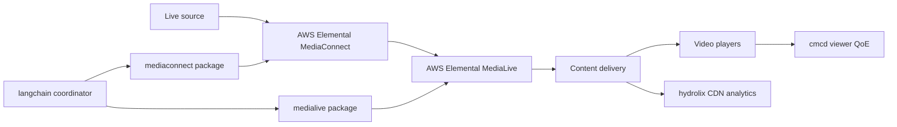

<div align="center">
  
  <h1>Agentic Intelligent Media Operations</h1>

  [](https://github.com/aws/mit-0)
</div>

## Purpose

Investigate live-video transport, encoding, delivery, and viewer-experience
problems with focused AI-agent samples.

Choose the operator outcome you need:

| I want to… | Sample | Start with | Status |
|---|---|---|---|
| Find regional buffering, bitrate, or playback-error patterns in CMCD data | [`cmcd`](cmcd-mcp-server/) | `just run cmcd` | From step 1 |
| Inspect MediaConnect flow health, packet loss, metrics, or thumbnails | [`mediaconnect`](mediaconnect-mcp-server/) | `just run mediaconnect` | From step 2 |
| Inspect MediaLive channels, inputs, outputs, schedules, or alarms | [`medialive`](medialive-mcp-server/) | `just run medialive` | From step 3 |
| Investigate a signal path across MediaConnect and MediaLive | [`langchain`](media-services-langchain/) | `just demo` | From step 4c |
| Explore CDN and streaming analytics through a web application | [`hydrolix`](hydrolix-cdn-insights/) | `just deploy hydrolix` | From step 5 |

> [!IMPORTANT]
> These samples are for educational and reference purposes only. They are not
> intended for production use without security hardening, thorough testing,
> and customization for your environment.

## Architecture

The samples cover two connected views of a live-video workflow: the upstream
signal path and the downstream delivery and viewer-experience path.



- `mediaconnect` and `medialive` expose focused operational tools.
- `langchain` coordinates those packages as specialist agents.
- `cmcd` analyzes player telemetry stored in InfluxDB.
- `hydrolix` provides multi-agent CDN analytics with a web UI.

## Prerequisites

For the offline demo:

- Python 3.12 or newer (`uv` installs it automatically from `.python-version`).
- [`uv`](https://docs.astral.sh/uv/).
- [`just`](https://just.systems/), installed in the setup steps below.

For AWS-backed runs and deployments, also install:

- AWS CLI with configured credentials.
- Docker.
- Node.js 20 or newer and AWS CDK for CDK-based samples.
- Access to the selected Amazon Bedrock models.

Run the repository prerequisite check before starting:

```bash
just doctor
```

`just doctor` reports a fix command for each missing requirement.

### Models

Choose models once in the root `.env`. All local runs and deployments use the
same values.

| Role | Default | Used by | Change it |
|---|---|---|---|
| Reasoning agent | `us.anthropic.claude-sonnet-4-6` | LangChain coordinator, EML, EMX, MediaLive agent, Hydrolix agents, CMCD client | Edit `AGENT_MODEL_ID` in `.env` |
| Thumbnail vision | `us.anthropic.claude-haiku-4-5-20251001-v1:0` | MediaLive and MediaConnect thumbnail adapters | Edit `THUMBNAIL_MODEL_ID` in `.env` |
| Chart generation | `us.anthropic.claude-haiku-4-5-20251001-v1:0` | Hydrolix web UI | Edit `CHART_MODEL_ID` in `.env` |

Override one deployment without editing `.env`:

```bash
AGENT_MODEL_ID=<model-id> just deploy <key>
```

A reasoning agent must not use a Haiku model.

## Setup and Run

### Run Locally

1. Clone the repository:

   ```bash
   git clone https://github.com/aws-samples/sample-agentic-video-operations.git
   cd sample-agentic-video-operations
   ```

2. Install `just`:

   ```bash
   uv tool install rust-just
   ```

3. Create local configuration:

   ```bash
   cp .env.example .env
   ```

4. Check prerequisites:

   ```bash
   just doctor
   ```

5. From step 4c, run the fixture-backed cross-service demo:

   ```bash
   just demo
   ```

Until step 4c lands, use the individual sample READMEs for their currently
available run paths. The demo requires no AWS account. It replays a MediaConnect
transport problem, shows the MediaConnect and MediaLive specialist work, and
prints the final diagnosis without calling AWS.

Run an individual sample with:

```bash
just run <key>
```

See that sample's README for configuration, MCP client setup, and a known-good
request.

### Deploy to AWS

Deploy a sample with its existing CloudFormation or CDK material:

```bash
just deploy <key>
```

The command prints the AWS account and region and asks for confirmation.
Deployments create billable resources. Write permissions are disabled by
default; explicitly set `ALLOW_WRITES=true` only when they are required.

### Verify the Deployment

Follow the deployed verification request in the sample README. It provides an
exact request against the deployed endpoint and the expected operational result.

## Teardown

Stop a local process with `Ctrl+C`.

Destroy everything created by a sample deployment:

```bash
just destroy <key>
```

If you created the demonstration MediaLive channel, remove it separately:

```bash
just demo-channel delete
```

Confirm the related CloudFormation stacks and manually created media resources
are gone. Orphaned infrastructure can continue to incur cost.

## Known Limitations

- The repository contains educational samples, not a production platform.
- Security hardening, tenant isolation, quotas, and operational runbooks remain
  the adopter's responsibility.
- Model output is nondeterministic and must not replace operational policy.
- Some samples currently require AWS to demonstrate their complete use case;
  fixture-backed coverage is being added incrementally.
- Write operations require explicit enablement, approval, and verification.
- Supported regions and model availability depend on the selected AWS account.

## Development

Use the root commands:

```bash
just doctor
just test <key>
just lint
just eval
```

Read [`AGENTS.md`](AGENTS.md) before changing code. Sample READMEs follow
[`docs/write_sample_readme.md`](docs/write_sample_readme.md).

## Contributing

Contributions are welcome. Keep changes focused, include offline tests, and
follow [`CONTRIBUTING.md`](CONTRIBUTING.md).

## Security

Never commit `.env` files, credentials, account IDs, ARNs, or real resource
IDs. Report security issues using the process in
[`CONTRIBUTING.md`](CONTRIBUTING.md#security-issue-notifications).

## License

This project is licensed under the MIT No Attribution License. See
[`LICENSE`](LICENSE).
