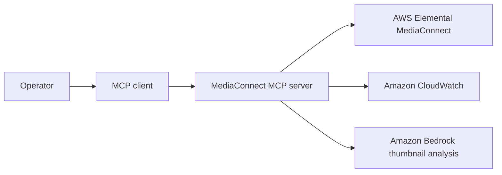

# Write a Sample README

Use this template for every runnable sample. Keep the README on the shortest
path from clone to a verified result. Move deeper material into focused files
under `docs/`.

The example below uses the `mediaconnect` MCP sample. Replace its names,
commands, tools, and cleanup steps with those of the sample being documented.

---

# MediaConnect MCP Server

Inspect MediaConnect flow health, metrics, and output thumbnails from an
MCP-compatible assistant.

> [!IMPORTANT]
> This sample is for educational and reference purposes. It is not
> production-ready without security hardening, testing, and customization.

## Purpose

Use this sample when an operator needs to understand whether live-video
transport is healthy before investigating downstream encoding or delivery.

The first successful run starts the MCP server locally and makes its read-only
flow inspection tools available to an MCP client.

## Architecture



The entrypoint handles MCP transport. Focused adapters call MediaConnect,
CloudWatch, or Bedrock. Write adapters are unavailable unless
`ALLOW_WRITES=true`, and every write requires approval and verification.

## Prerequisites

- Python 3.12 or newer (`uv` installs it automatically from `.python-version`).
- [`uv`](https://docs.astral.sh/uv/).
- [`just`](https://just.systems/), installed with `uv tool install rust-just`.
- An MCP-compatible client.
- For AWS-backed use: configured AWS credentials and access to the services
  shown in the architecture diagram.

Check the complete repository prerequisites:

```bash
just doctor
```

Raw command:

```bash
uv run scripts/check_prerequisites.py
```

## Setup and Run

### Run Locally

Clone the repository and enter its root:

```bash
git clone https://github.com/aws-samples/sample-agentic-video-operations.git
cd sample-agentic-video-operations
```

1. Create the one root configuration:

   ```bash
   cp .env.example .env
   ```

2. Install `just`:

   ```bash
   uv tool install rust-just
   ```

3. Uncomment only this sample's labelled section in the root `.env`, then add
   required live values. Keep safe defaults such as `ALLOW_WRITES=false`.

4. Start the sample:

   ```bash
   just run mediaconnect
   ```

   Raw command:

   ```bash
   uv run --package mediaconnect-mcp-server serve-mediaconnect
   ```

5. Configure an MCP client:

   ```json
   {
     "mcpServers": {
       "mediaconnect": {
         "command": "uv",
         "args": [
           "run",
           "--directory",
           "/path/to/sample-agentic-video-operations",
           "--package",
           "mediaconnect-mcp-server",
           "serve-mediaconnect"
         ]
       }
     }
   }
   ```

6. Send a known-good request:

   ```text
   List my MediaConnect flows and summarize their current state.
   ```

   Expected result:

   ```text
   The assistant calls the read-only flow listing tool and returns each
   available flow with its name and current state.
   ```

### Deploy to AWS

This sample has no standalone deployment. It runs in AWS as a domain pack of the
`hub` sample:

```bash
just deploy hub
```

Raw command:

```bash
uv run python scripts/manage_hub_stack.py deploy
```

> [!WARNING]
> Deployment creates billable AWS resources. Confirm the account and region
> printed by the command before continuing.

### Verify the Deployment

Invoke the deployed hub with a known-good request:

```bash
uv run python scripts/invoke_hub.py \
  --actor example-operator \
  "List all MediaConnect flows"
```

Expected result:

```text
The hub calls the MediaConnect domain pack and returns the available flows with
their names and current states.
```

## Available Tools

| Tool | Read/write | What it does |
|---|---|---|
| `list_flows` | Read | Lists MediaConnect flows and their states |
| `describe_flow` | Read | Returns configuration and health for one flow |
| `describe_flow_thumbnail` | Read | Analyzes a flow output thumbnail |
| `stop_flow` | Write | Stops one approved flow and verifies its state |

## Teardown

Stop the local MCP process with `Ctrl+C`.

Destroy the AWS deployment:

```bash
just destroy hub
```

Raw command:

```bash
uv run python scripts/manage_hub_stack.py destroy
```

Teardown checklist:

- [ ] Stop local processes.
- [ ] Run `just destroy <key>` for every deployed sample.
- [ ] Confirm the CloudFormation stacks are deleted.
- [ ] Remove manually created media resources.
- [ ] Check for retained log groups, container images, secrets, or data.

Orphaned infrastructure can continue to incur cost.

## Known Limitations

- The sample is educational and is not production-ready.
- Model responses are nondeterministic.
- IAM, tenant isolation, retries, and scaling require production review.
- Write operations require `ALLOW_WRITES=true` and additional safeguards.
- Demo fixtures do not reproduce every AWS service behavior.

## Development

Run the offline checks:

```bash
just test mediaconnect
just lint
```

Keep adapters focused on one external action, return typed results, and use
fixture-backed tests.

## Contributing

Read the root [`AGENTS.md`](../AGENTS.md) and
[`CONTRIBUTING.md`](../CONTRIBUTING.md) before opening a pull request.

## Security

Never commit credentials, `.env` files, account IDs, ARNs, or real media
resource IDs. Report security issues through the process in
[`CONTRIBUTING.md`](../CONTRIBUTING.md#security-issue-notifications).

## License

This project is licensed under the MIT No Attribution License. See
[`LICENSE`](../LICENSE).
