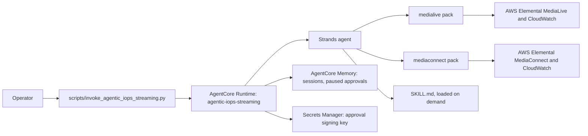

# agentic-iops-streaming

One agent that investigates live-video problems across AWS Elemental MediaLive and
MediaConnect, and asks an operator before it changes anything.

> [!IMPORTANT]
> This sample is for educational and reference purposes. It is not
> production-ready without security hardening, testing, and customization.

## Purpose

Use agentic-iops-streaming when an operator needs to know why viewers see a problem, and where on the
signal path from MediaConnect flow to MediaLive channel it starts.

It is one Strands agent on Amazon Bedrock AgentCore. Each media service plugs in as a
**domain pack** (`samples/medialive`, `samples/mediaconnect`, and the read-only `hls` pack
from `samples/hls-doctor`), chosen with `MEDIA_DOMAINS`.
The first successful run, `just demo`, replays a recorded input-loss incident through the
real agent and needs no AWS account.

## Architecture



- **Reads** run freely. **Media-resource writes** (start, stop, input switch, schedule
  actions) exist only with `ALLOW_WRITES=true`. They pause for an operator decision, are
  signed for exactly the approved action, and are verified after they run.
- **Workflow discovery** has its own switch, `ALLOW_WORKFLOW_DISCOVERY`, on by default and
  independent of `ALLOW_WRITES`. `discover_workflow` creates a signal map tagged
  `managed-by` in your account, reads the chain it maps, and deletes it. `save_workflow` is
  an approved write, like the media writes, but only to this sample's own workflow store.
  It is a runtime setting: in a local run, `false` registers none of the four workflow
  tools. The deploy doesn't pass it, so a deployed runtime always runs with discovery on,
  and the stack always grants the workflow IAM (the tag-scoped signal-map actions and the
  workflow table).
- **Events stream** as each happens: `task_started`, `tool_called`, `action_completed`,
  `verification_completed`, then `usage_reported` immediately before the terminal
  `approval_requested`, `final_answer`, or `error`.
- The design is in [`docs/extend_agentic_iops_streaming.md`](../../docs/extend_agentic_iops_streaming.md).

### Trust model

The agent keeps one operator's pending approvals and sessions from another's by the actor
id, in AgentCore Memory when deployed and in per-actor session files locally, under
`.cache/agentic-iops-sessions` (git-ignored, kept out of the image, and removed by `just clean`).
`SESSION_DIR` may move them elsewhere under `.cache/`, or outside the repository, where
protecting them is up to you; any other path inside the repository is refused. Where that id
comes from depends on the inbound authorization you deploy with. A
runtime accepts IAM callers or bearer tokens, never both.

| | IAM (default) | JWT (`AGENTIC_IOPS_JWT_DISCOVERY_URL` and `AGENTIC_IOPS_JWT_CLIENT_IDS` set) |
|---|---|---|
| Who may call | Principals your IAM allows to invoke. The stack outputs `InvokePolicyArn`; `AGENTIC_IOPS_INVOKER_ROLE_NAME` attaches it to one role at deploy. | Holders of a current access token issued by that provider to one of those app clients. AgentCore verifies the signature, issuer, expiry and `client_id` before the request reaches the agent. |
| Who the actor is | The `X-Amzn-Bedrock-AgentCore-Runtime-Custom-Actor-Id` header, **supplied by the caller and not verified**. Any principal that may invoke can claim any actor id, so isolation holds only among principals you trust to invoke. | The token's `sub`. The stack forwards only the `Authorization` header, and the runtime ignores any actor header. One user can't act as another. |
| Write IAM scope | With `ALLOW_WRITES=true`, every selected-pack channel and flow in this account and region is writable by default. `AGENTIC_IOPS_WRITE_TAG=Key=Value` limits writes to resources carrying that exact tag. The HMAC approval still binds each call to its exact action, resource and parameters. | The same write scope and HMAC approval boundary as IAM auth. |
| Refused | A request without the header. | A request without a valid token. The runtime also re-checks the token's issuer, client, expiry and subject, and fails closed if they don't match its settings. |

- **What JWT mode does not do:** the runtime doesn't re-verify the token signature. AgentCore
  already has, and the runtime reads the claims only on a JWT-authorized runtime: the CDK sets
  `AGENTIC_IOPS_JWT_ISSUER` there alone, and the runtime refuses to start with it in local mode.
- **Actor ids are memory actor ids.** Amazon Cognito subjects (UUIDs) work as they are.
  With another identity provider, check that its `sub` values are valid AgentCore Memory
  actor ids.

## Prerequisites

- Python 3.12 or newer (`uv` installs it from the root `.python-version`).
- [`uv`](https://docs.astral.sh/uv/) and [`just`](https://just.systems/)
  (`uv tool install rust-just`).
- For AWS: credentials for a non-production account, Node.js 20+, Docker, a CDK
  bootstrap in your `AWS_REGION`, and access to the Bedrock model in `AGENT_MODEL_ID`.

Check them:

```bash
just doctor        # offline checks
just doctor aws    # also AWS, Docker, CDK bootstrap
```

Raw command:

```bash
uv run python scripts/check_prerequisites.py
```

## Setup and Run

### Run Locally

1. Clone the repository and enter it:

   ```bash
   git clone https://github.com/aws-samples/sample-agentic-video-operations.git
   cd sample-agentic-video-operations
   ```

2. Replay the recorded incident. No AWS account and no Bedrock call are needed:

   ```bash
   just demo
   ```

   Raw command:

   ```bash
   uv run --package agentic-iops-streaming demo-agentic-iops-streaming
   ```

   Expected result: the agent calls `list_channels`, `load_skill`, `check_channel_issues`
   and `read_channel_logs`, then answers that pipeline 0 of `demo-channel` lost its SRT
   input.

3. Run the agentic-iops-streaming server locally with a real model (Bedrock is billed). Copy and edit the root
   `.env` first:

   ```bash
   cp .env.example .env    # set AGENT_MODEL_ID; DEMO=1 keeps AWS reads on fixtures
   just run agentic-iops-streaming
   ```

   It listens on `http://localhost:8080` (`/ping`, `/invocations`). To share a
   host with another service, set `AGENTIC_IOPS_PORT` in the root `.env`, for
   example `AGENTIC_IOPS_PORT=8091`. It is for local runs only: the deployed container
   refuses any port but 8080, the one AgentCore serves it on.

### Deploy to AWS

> [!WARNING]
> Deployment creates billable AgentCore Runtime and Memory, a Secrets Manager secret,
> Bedrock usage and an ECR image. Confirm the account and region the command prints.

```bash
just deploy agentic-iops-streaming
```

Raw command:

```bash
uv run python scripts/manage_agentic_iops_streaming_stack.py deploy
```

- **One confirmation, before anything is built.** The command checks the CDK bootstrap
  ("CDK bootstrap: found (CDKToolkit, qualifier hnb659fds, version N)", or what to fix:
  a missing stack, another qualifier than the app's, or a version below 6), prints the
  security changes (`cdk diff --security-only`, from templates: no image is built and no
  change set is created), and then asks once. The plan says "none" when CDK reports no
  security-related changes. The deploy stops unless CDK printed its result for this stack
  (a failed diff, no output, or only a warning or notice stops it). CDK deploys with
  `--require-approval never`, so it never stops after the image build to ask again.
  `--yes` answers the one prompt, and the plan says so. Without a terminal and without
  `--yes`, it stops at the prompt with "No terminal: re-run with --yes after reviewing
  the plan above".
- **Bedrock:** the runtime may invoke only `AGENT_MODEL_ID` and `THUMBNAIL_MODEL_ID`
  (each one's inference profile, and the foundation model behind it), not every model.
  See [`cdk/README.md`](cdk/README.md).
- `MEDIA_DOMAINS` (default `medialive,mediaconnect`) selects the packs. IAM comes from
  each selected pack's `samples/<key>/iam_permissions.json`. Write permissions are added
  only with `ALLOW_WRITES=true`. By default that covers every selected-pack channel and
  flow in the deployed account and region. Set `AGENTIC_IOPS_WRITE_TAG=Key=Value` before deployment
  to require that exact resource tag on every MediaLive or MediaConnect write. For
  `BatchUpdateSchedule`, the tag limits which channel may change; the approved proposal and
  HMAC signature bind the exact schedule action and parameters.
- **Inbound auth:** IAM by default. To accept bearer tokens instead, set
  `AGENTIC_IOPS_JWT_DISCOVERY_URL` (your identity provider's OIDC discovery URL, for example an
  Amazon Cognito user pool's) and `AGENTIC_IOPS_JWT_CLIENT_IDS` (the app client ids allowed to
  call) before deploying. `AGENTIC_IOPS_INVOKER_ROLE_NAME` can't be combined with them.
- Outputs: `AgentRuntimeArn`, `AgentRuntimeId`, `AgentEndpointName`, `MemoryId`,
  `MediaDomains`, `InboundAuth` (`iam` or `jwt`), `InvokePolicyArn` (IAM mode only), and
  `WorkflowTableName`: the retained workflow store, which `just destroy agentic-iops-streaming`
  names again as left in place by design.

### Verify the Deployment

```bash
uv run python scripts/invoke_agentic_iops_streaming.py --actor <your-operator-id> "List my MediaLive channels"
```

Expected result: `task_started`, `tool_called` (`list_channels`), `usage_reported`, then
a `final_answer` listing your channels. A paused write prints `usage_reported` followed by
an `approval_requested` event; answer it with `--session <id> --approve <approval_id>`
(or `--reject`).

On a JWT-authorized runtime, put a current access token in `AGENTIC_IOPS_BEARER_TOKEN` (root `.env`
or the shell, never an argument) and leave out `--actor`. The script then calls the
runtime over HTTPS with the token, because boto3 can't send bearer tokens.

## Teardown

```bash
just destroy agentic-iops-streaming
```

Raw command:

```bash
uv run python scripts/manage_agentic_iops_streaming_stack.py destroy
```

It deletes the stack (runtime, endpoint, memory, signing-key secret, roles, invoke
policy) and the log groups of this runtime only. If a step fails, it prints exactly what
remains. **The workflow table is left in place by design:** it holds the workflows operators
confirmed, so the stack retains it. The confirmation and the result name it, with the
`aws dynamodb delete-table --region … --table-name …` command to run when you no longer need
them; the script never runs it. A deploy that failed and rolled back leaves the stack in the ROLLBACK_COMPLETE state;
`just destroy agentic-iops-streaming` deletes that too (the confirmation shows the status), and
then you can deploy again. The CDK bootstrap ECR repository may keep the
agentic-iops-streaming image; remove it there if unused.

### Upgrading from the hub sample

This sample was called `hub`, and deployed a stack named `MediaOpsHubStack`. The new stack
is a separate deployment, so an old one keeps running, and billing, until you delete it.
Nothing in this repository deletes it for you. Check it is yours, then delete it once:

```bash
aws cloudformation delete-stack --stack-name MediaOpsHubStack --region "$AWS_REGION"
```

Its AgentCore Memory goes with it, with the session history and paused approvals it held.
Settings named HUB_ in the root `.env` are now named AGENTIC_IOPS_ (for example
AGENTIC_IOPS_WRITE_TAG). An old name would be ignored, which fails open (a stale
HUB_WRITE_TAG would deploy writes without the tag scope), so `just deploy
agentic-iops-streaming` and the runtime both refuse to start while any is set, naming each
one and its new name. `just doctor` lists them too.

An upgraded clone also keeps the old release's local output: the git-ignored samples/hub
folder (its node_modules and cdk.out), every `cdk.out/`, the CDK apps' compiled `.js` and
`.d.ts`, and an eval-results.json file at the repository root. `just clean` removes them and
prints each path. It keeps the samples/hub folder, and names it, if anything there is
tracked or not ignored.
`just clean-all` also removes every `node_modules/`; run `npm ci` in a CDK folder before its
next deploy.

## Known Limitations

- **With IAM auth, actor ids are not authenticated.** See the trust model above; deploy
  with JWT auth to bind the actor to a verified identity.
- **The demo is scripted.** `just demo` uses a scripted model over synthetic fixtures; it
  shows the plumbing, not model quality.
- **One agentic-iops-streaming deployment per account and region:** the runtime name is fixed.
- **Not covered by the offline tests:** the container build and a real deployment. Run
  `just deploy agentic-iops-streaming` in a sandbox account to check them.

## Development

```bash
just test agentic-iops-streaming
just lint
just docs-check
cd samples/agentic-iops-streaming/cdk && npm ci && npm test && npx cdk synth --quiet
```

## Contributing

Read the root [`AGENTS.md`](../../AGENTS.md) and
[`CONTRIBUTING.md`](../../CONTRIBUTING.md) before opening a pull request.

## Security

Never commit `.env` files, account ids, ARNs, or real channel and flow ids. Report
security issues through the process in
[`CONTRIBUTING.md`](../../CONTRIBUTING.md#security-issue-notifications).

## License

This project is licensed under the MIT No Attribution License. See
[`LICENSE`](../../LICENSE).
