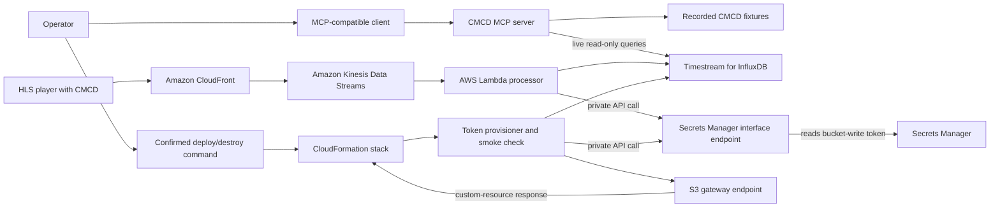
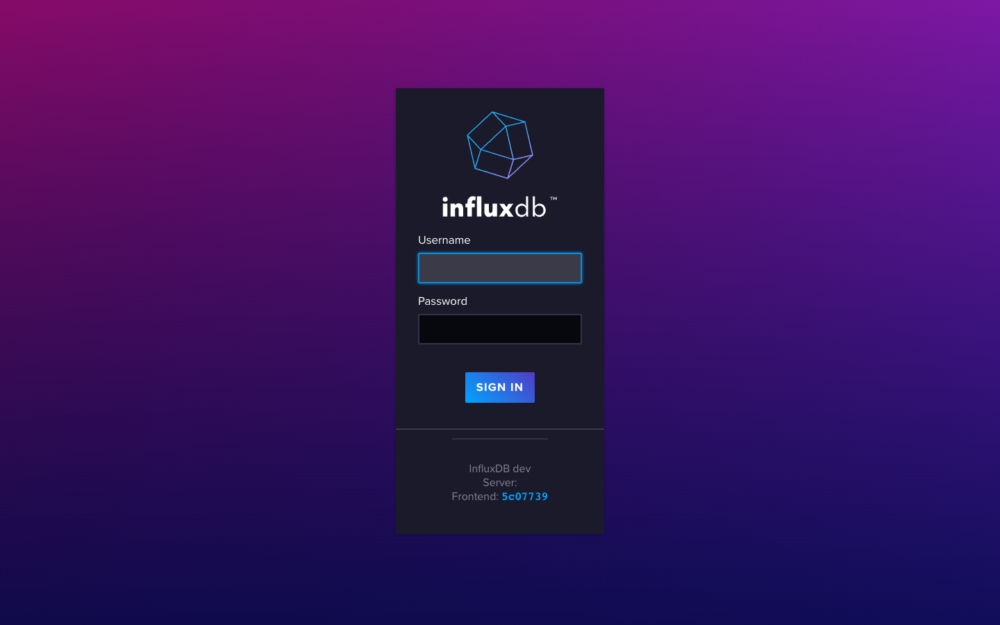
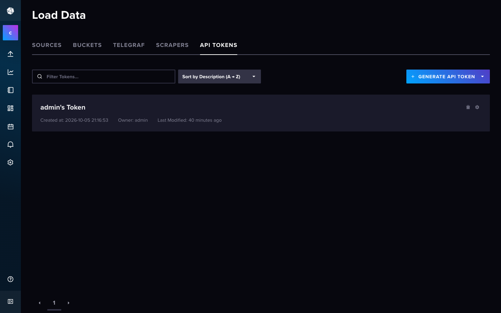
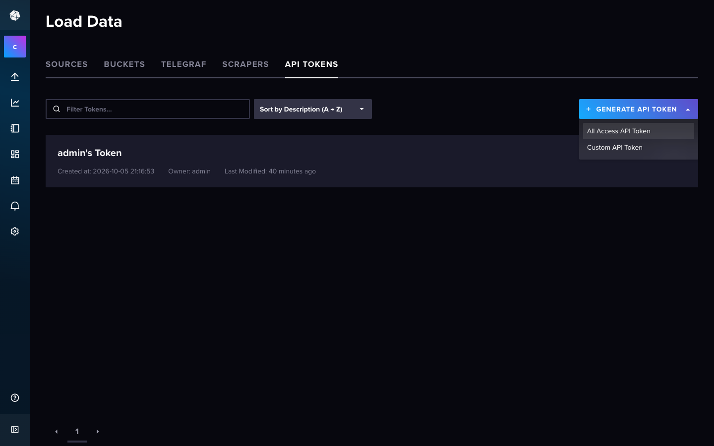
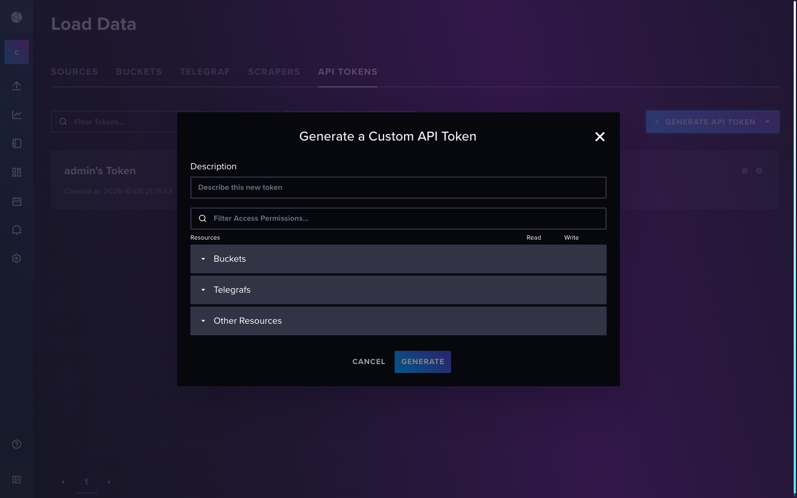
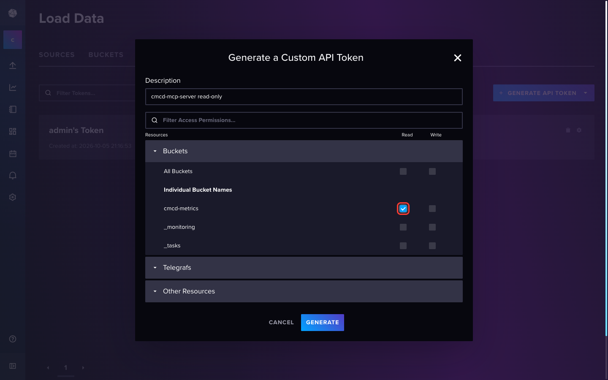
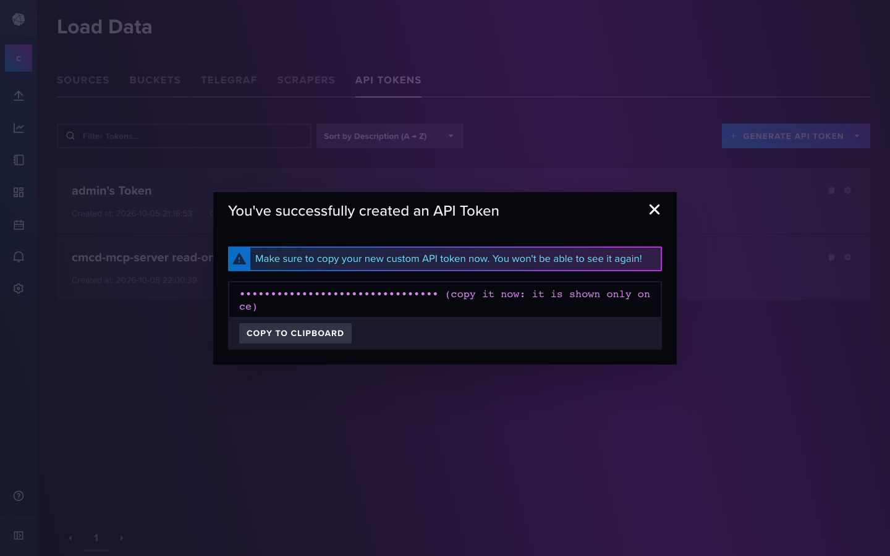

# CMCD MCP Server

Find viewer rebuffering, bitrate, startup, and session patterns from Common
Media Client Data (CMCD) without manually writing InfluxDB queries.

> [!IMPORTANT]
> This AWS sample is for educational and reference purposes. It requires
> security hardening, testing, and customization before production use.

## Purpose

Use this sample when a video operator needs evidence about viewer quality of
experience: which sessions buffered, where low-buffer events concentrated, and
whether startup activity or bitrate behavior provides incident context.

The first successful run uses recorded telemetry, needs no AWS account, and
lets any MCP-compatible assistant report three low-buffer events concentrated
at one demo edge location and CDN.

## Architecture



The MCP entrypoint owns stdio transport and selects either fixtures or an
InfluxDB connection. Each tool delegates one read action to a focused
InfluxDB adapter and returns typed evidence. The MCP server exposes no write
tools.

For live use, the database stays in private subnets. The local MCP process
reaches it through an AWS Systems Manager port-forwarding session. Deployment
creates separate bucket-scoped read and write tokens, stores both in Secrets
Manager, and proves the pipeline can write and read a smoke point. The
processor loads only its write token from the secret; the local MCP command
copies only the read token into root `.env`. Deployment
and teardown are separate, confirmed operations; they are not callable through
MCP. An S3 gateway endpoint on the private route table keeps the token
provisioner's CloudFormation response path available while the stack is being
deleted. A two-AZ Secrets Manager interface endpoint carries the only AWS API
calls made by the private-subnet Lambdas, so they need no NAT gateway. Lambda
delivers function logs through its managed logging path; the function code
does not call the CloudWatch Logs API. The public SSM bastion reaches AWS
through its Internet gateway. The provisioner must stay in the VPC because
the InfluxDB endpoint is private; moving it outside the VPC would remove its
only route to the database.

## Prerequisites

For the local fixture demo:

- Python 3.12 or newer. `uv` installs the repository's Python version from
  `.python-version`.
- [`uv`](https://docs.astral.sh/uv/).
- [`just`](https://just.systems/), installed with
  `uv tool install rust-just`.
- An MCP-compatible client, such as Amazon Q CLI, Claude Desktop, Cursor, or
  another client that can launch a stdio server.

For the AWS-backed path, also provide:

- AWS CLI v2 and the Session Manager plugin.
- AWS credentials allowed to use CloudFormation, CloudFront, WAF, S3, KMS,
  Kinesis, Lambda, Timestream for InfluxDB, EC2/VPC, Systems Manager, Secrets
  Manager, SQS, IAM, and CloudWatch Logs.
- Service quota for a `db.influx.medium` Timestream for InfluxDB instance,
  the smallest supported class, and the other resources above.
- `ffmpeg` to generate the documented test stream, or an existing HLS playlist
  named `master.m3u8` and its media segments.
- Region `us-east-1`. The stack is pinned there because its CloudFront-scoped
  WAF web ACL must be created in `us-east-1`.

The AWS deployment creates billable resources, including CloudFront, Kinesis,
a `db.influx.medium` InfluxDB instance, two Secrets Manager interface-endpoint
hours, a `t3.nano` EC2 bastion, and one public IPv4 address.

### Cost reduction

The change below covers only the resources whose defaults changed. Prices are
Linux on-demand rates in `us-east-1`, verified October 6, 2026; unchanged
services, storage, requests, data transfer, and the bastion's public IPv4
address are excluded from both sides.

| Path | Fixed hourly cost |
|---|---:|
| Earlier: NAT gateway + its public IPv4 + `t3.micro` bastion | $0.0604 |
| Current: Secrets Manager endpoint in two AZs + `t3.nano` bastion | $0.0252 |
| Reduction | **$0.0352/hour (about $25.70 per 730-hour month)** |

The private API data-processing rate also falls from $0.045/GB through the NAT
gateway to $0.01/GB through AWS PrivateLink for the first petabyte. The S3
gateway endpoint has no hourly charge. Timestream for InfluxDB remains
`db.influx.medium` because AWS offers no smaller class; the class is a
CloudFormation parameter for operators who need more capacity.

Pricing sources:

- [Amazon VPC pricing](https://aws.amazon.com/vpc/pricing/)
- [AWS PrivateLink pricing](https://aws.amazon.com/privatelink/pricing/)
- [Amazon EC2 On-Demand pricing](https://aws.amazon.com/ec2/pricing/on-demand/)
- [Timestream for InfluxDB instance types](https://docs.aws.amazon.com/timestream/latest/developerguide/supported-instance-types.html)

Check the local tools:

```bash
python3 --version
uv --version
just --version
```

Before deployment, also check the AWS identity:

```bash
aws --version
session-manager-plugin --version
aws sts get-caller-identity
```

## Setup and Run

### Run Locally

Clone the repository and enter its root:

```bash
git clone https://github.com/aws-samples/sample-agentic-video-operations.git
cd sample-agentic-video-operations
```

1. Create the one root configuration:

   ```bash
   cp .env.example .env
   ```

2. Install `just`:

   ```bash
   uv tool install rust-just
   ```

3. Start the fixture-backed server:

   ```bash
   DEMO=1 just run cmcd
   ```

   Raw command:

   ```bash
   DEMO=1 uv run --package cmcd-mcp-server serve-cmcd
   ```

   A stdio MCP server waits silently for a client connection. Stop this smoke
   check with `Ctrl+C`; the client configuration in the next step launches the
   same command for you.

4. Add an entry from [`mcp.json`](mcp.json) to your MCP client configuration,
   replacing the repository path with its absolute path. For the offline demo, add only
   `cmcd-demo`. The live `cmcd` entry starts without a deployment too, but each of its
   tools returns `INFLUXDB_URL … not set` until Deploy to AWS step 6 has run:

   ```json
   {
     "mcpServers": {
       "cmcd": {
         "command": "uv",
         "args": [
           "run",
           "--directory",
           "/absolute/path/to/sample-agentic-video-operations",
           "--env-file",
           ".env",
           "--package",
           "cmcd-mcp-server",
           "serve-cmcd"
         ]
       },
       "cmcd-demo": {
         "command": "uv",
         "args": [
           "run",
           "--directory",
           "/absolute/path/to/sample-agentic-video-operations",
           "--package",
           "cmcd-mcp-server",
           "serve-cmcd"
         ],
         "env": {
           "DEMO": "1",
           "DEMO_SCENARIO": "cmcd_rebuffering",
           "ALLOW_WRITES": "false"
         }
       }
     }
   }
   ```

5. Restart the MCP client and send this known-good request to `cmcd-demo`:

   ```text
   Find CMCD buffer events below 500 ms in the last 24 hours. Summarize where
   they are concentrated.
   ```

   Expected result:

   ```text
   The assistant calls analyze_buffer_events and reports 5 total events,
   including 3 below 500 ms. All 3 low-buffer events are at demo-edge-west on
   demo-cdn.
   ```

### Deploy to AWS

1. From the repository root, create the shared configuration:

   ```bash
   cp .env.example .env
   ```

   The deployment uses your active AWS credentials. You may also set these
   optional values in the root `.env`:

   ```dotenv
   # Domain used only when adapting the template's custom origin.
   CMCD_ORIGIN_DOMAIN=example.com
   # Full, globally unique bucket name. Leave unset to use cmcd-content-<account id>.
   CMCD_S3_BUCKET_NAME=
   # Optional deployment-artifact bucket override if the generated name is unavailable.
   CMCD_ARTIFACTS_BUCKET=
   ```

2. Deploy the `video-ops-cmcd` CloudFormation stack:

   ```bash
   just deploy cmcd
   ```

   Raw command:

   ```bash
   uv run --env-file .env python scripts/manage_cmcd_stack.py deploy
   ```

   The default is the smallest InfluxDB class and a lightweight port-forward
   host. Override either parameter only when needed:

   ```bash
   just deploy cmcd --influxdb-instance-type db.influx.large \
     --bastion-instance-type t3.micro
   ```

   > [!WARNING]
   > This command creates billable AWS resources. Read the printed account,
   > region, stack, and cost-bearing services before confirming.

   A successful deployment prints its measured CloudFormation elapsed time,
   `smoke write/read: passed` after the token provisioner has written and read
   a test point, and `just destroy cmcd` as the cleanup reminder.

3. Generate a three-minute, two-rendition test-pattern HLS stream:

   ```bash
   CMCD_HLS_DIR="$(mktemp -d "${TMPDIR:-/tmp}/cmcd-hls.XXXXXX")"
   ffmpeg -f lavfi -i testsrc2=size=1280x720:rate=30 \
     -f lavfi -i sine=frequency=1000:sample_rate=48000 -t 180 \
     -filter_complex \
       "[0:v]split=2[v720][v360];[v360]scale=640:360[v360out]" \
     -map "[v720]" -map 1:a -map "[v360out]" -map 1:a \
     -c:v libx264 -preset veryfast -pix_fmt yuv420p \
     -b:v:0 2800k -maxrate:v:0 2996k -bufsize:v:0 4200k \
     -b:v:1 900k -maxrate:v:1 963k -bufsize:v:1 1350k \
     -c:a aac -b:a:0 128k -b:a:1 96k \
     -g 180 -keyint_min 180 -sc_threshold 0 \
     -f hls -hls_time 6 -hls_playlist_type vod \
     -hls_segment_filename "${CMCD_HLS_DIR}/v%v/segment-%03d.ts" \
     -master_pl_name master.m3u8 \
     -var_stream_map "v:0,a:0,name:720p v:1,a:1,name:360p" \
     "${CMCD_HLS_DIR}/v%v/index.m3u8"
   ```

   The master playlist contains `EXT-X-STREAM-INF` bandwidth metadata, so the
   player emits a real requested bitrate (`br`) instead of the placeholder
   zero produced by a single media playlist. Or use an existing multivariant
   `master.m3u8` and its media segments.

4. Upload the HLS playlist and segments to the stack's content bucket:

   ```bash
   CMCD_BUCKET="$(aws cloudformation describe-stacks \
     --stack-name video-ops-cmcd \
     --region us-east-1 \
     --query "Stacks[0].Outputs[?OutputKey=='S3BucketName'].OutputValue" \
     --output text)"
   aws s3 cp "${CMCD_HLS_DIR}/" \
     "s3://${CMCD_BUCKET}/videos/" \
     --recursive \
     --region us-east-1
   rm -r -- "${CMCD_HLS_DIR}"
   ```

5. Print the generated connection commands and keep the printed Systems
   Manager tunnel running in another terminal:

   ```bash
   uv run python scripts/manage_cmcd_stack.py show-next-steps
   ```

6. With the tunnel running, create or reuse the least-privilege read token and
   write the live connection settings to the root `.env`:

   ```bash
   just cmcd-token
   ```

   Raw command:

   ```bash
   uv run python scripts/manage_cmcd_stack.py create-read-token
   ```

   The command asks for its own confirmation, reads the admin credentials
   without printing them, and creates or reuses the token named
   `cmcd-mcp-server read-only`. That token has exactly one permission: Read on
   the `cmcd-metrics` bucket in `cmcd-org`. The command proves that a read
   returns HTTP 200 and a write returns HTTP 403, replaces the root `.env`
   connection values, and prints only `written` after success. It sets
   `VERIFY_SSL=false` only for this local tunnel.

   <details>
   <summary>Manual fallback: create the read-only token in the InfluxDB UI</summary>

   1. Open `https://localhost:8086` while the tunnel is active. Sign in with
      username `admin` (the secret's `username` field). Read only `.password`:

      ```bash
      aws secretsmanager get-secret-value \
        --region us-east-1 \
        --secret-id <InfluxDBSecretArn> \
        --query SecretString \
        --output text |
        python3 -c 'import json,sys; print(json.load(sys.stdin)["password"])'
      ```

      

   2. The browser warns about a self-signed certificate for `localhost`
      because the certificate names the private host. Accept it for this
      tunnel only.

   3. In the collapsed sidebar, click the unlabelled up-arrow icon for Load
      Data, then select the **API TOKENS** tab.

      

   4. Open **GENERATE API TOKEN**. Its first entry is All Access; choose
      **Custom API Token**, never All Access.

      

   5. Enter the description `cmcd-mcp-server read-only`. Expand **Buckets**,
      then under Individual Bucket Names tick only **Read** on
      `cmcd-metrics`. Leave All Buckets, Write, `_monitoring`, `_tasks`,
      Telegrafs, and Other Resources unticked.

      

      

   6. Generate the token. It is shown once. Paste it directly into
      `INFLUXDB_TOKEN` in the root `.env`, never into a chat or terminal.

      

   7. Do not copy **admin's Token** from the token list. It is the all-access
      operator token.

   Then verify the manual token while the tunnel remains active:

      ```bash
      just cmcd-token-verify
      ```

      Raw command:

      ```bash
      uv run python scripts/verify_influxdb_read_token.py
      ```

      The expected result is `read 200; write 403`.

   </details>

7. Open the `VideoPlayerURL` printed after deployment and play the HLS stream
   long enough to generate CMCD telemetry.

8. Start the live MCP server:

   ```bash
   just run cmcd
   ```

   Keep the Systems Manager tunnel from step 5 running while using the live
   server. Without it, the first tool call cannot reach InfluxDB and times out.

   Raw command:

   ```bash
   uv run --env-file .env --package cmcd-mcp-server serve-cmcd
   ```

### Verify the Deployment

Confirm that the stack completed:

```bash
aws cloudformation describe-stacks \
  --stack-name video-ops-cmcd \
  --region us-east-1 \
  --query "Stacks[0].StackStatus" \
  --output text
```

The expected status is `CREATE_COMPLETE` or `UPDATE_COMPLETE`.

Configure the `cmcd` MCP entry from the local-run section, restart the client,
and send:

```text
List the CMCD session and content IDs observed in the last 24 hours, then
analyze playback errors for the newest session.
```

Expected result:

```text
The assistant lists at least one session and the video-content-demo content
ID, then reports typed playback evidence for the selected session. If no data
appears, keep the player running and retry after the stream processor has
delivered records.
```

## Available Tools

| Tool | Read/write | What it does |
|---|---|---|
| `get_average_bitrate` | Read | Calculates mean requested bitrate, optionally by session or content |
| `get_session_details` | Read | Returns a chronological metric timeline for one session |
| `analyze_buffer_events` | Read | Finds buffer measurements below a requested threshold |
| `identify_playback_errors` | Read | Detects buffer-starvation signals and sudden drops, with startup context |
| `list_session_and_content_ids` | Read | Lists distinct session and content identifiers |

## Teardown

Stop the local MCP process and Systems Manager tunnel with `Ctrl+C`.

From the repository root, destroy the AWS resources:

```bash
just destroy cmcd
```

Raw command:

```bash
uv run python scripts/manage_cmcd_stack.py destroy
```

Before confirmation, the command lists the exact content and deployment
artifact buckets, CloudFormation stack, retained InfluxDB instance, and Lambda
log groups it will remove. It then:

1. explicitly deletes the InfluxDB instance retained as a safety net by the
   template and waits, for at most 30 minutes, until its VPC network
   interfaces are gone;
2. empties the content bucket;
3. deletes the `video-ops-cmcd` stack and waits for completion. If the earlier
   token custom resource is already in `DELETE_FAILED` only because
   CloudFormation did not receive its response, the command retries while
   retaining only that inert custom-resource record;
4. deletes the stack's Lambda log groups; and
5. empties and deletes the stack-named deployment artifact bucket.

Each step treats an already-absent resource as complete. If discovery or any
deletion fails, fix the reported problem and run `just destroy cmcd` again;
the next run resumes safely instead of repeating a completed deletion. Before
reporting success or leftovers, the command performs fresh lookups for the
InfluxDB instance, both buckets, the stack, and its Lambda log groups. It also
prints separate timings for InfluxDB deletion and CloudFormation deletion; the
latter includes AWS-managed VPC Lambda network-interface release time.

Confirm the stack and log groups are gone:

```bash
aws cloudformation describe-stacks \
  --stack-name video-ops-cmcd \
  --region us-east-1
aws logs describe-log-groups \
  --region us-east-1 \
  --log-group-name-prefix /aws/lambda/video-ops-cmcd- \
  --query "logGroups[].logGroupName"
```

The first command should report that the stack does not exist, and the second
should return an empty list. KMS keys created by the stack remain scheduled for
AWS-managed deletion for 7–30 days; no manual action is required.

Do not delete the CloudFormation stack manually. The retained InfluxDB
instance and its network interfaces can block deletion of the VPC, subnets,
and security groups. `just destroy cmcd` removes and awaits the instance first.

Delete the local `.env` if it is no longer needed because it contains the
InfluxDB API token. Orphaned infrastructure and retained data can continue to
incur cost.

## Known Limitations

- This is an educational sample, not a production-ready monitoring service.
- The MCP server runs locally over stdio; the CloudFormation stack deploys the
  telemetry pipeline, not a hosted MCP runtime.
- Live database access requires a local Systems Manager tunnel.
- The stack and template are tested only in `us-east-1`.
- The sample has no multi-tenant isolation, high-availability guarantee,
  backup policy, alerting, or complete retry and recovery strategy.
- The deployment creates long-running cost-bearing resources, especially
  Timestream for InfluxDB. The endpoint and bastion defaults minimize the
  supporting fixed hourly cost but do not make the stack free.
- The MCP server intentionally exposes only typed analysis tools, not arbitrary
  Flux queries. Database permissions remain the primary control.
- Fixture playback covers one representative rebuffering incident, not every
  InfluxDB or CDN behavior.
- Tool results are deterministic for a given dataset, but an MCP client's
  model-generated explanation may vary.
- The provided IAM and network policies require a least-privilege production
  review.

## Development

Run the CMCD tests:

```bash
just test cmcd
```

Raw command:

```bash
uv run pytest samples/cmcd/tests
```

Run repository lint and formatting checks:

```bash
just lint
```

Raw commands:

```bash
uv run ruff check .
uv run ruff format --check .
```

Check README structure and relative links:

```bash
just docs-check
```

Raw command:

```bash
uv run python scripts/check_readme_structure.py
```

Keep each adapter focused on one external action, return typed results, and
cover behavior with root-level recorded fixtures.

## Contributing

Read [`AGENTS.md`](../../AGENTS.md) and
[`CONTRIBUTING.md`](../../CONTRIBUTING.md) before opening a pull request.

## Security

Never commit credentials, `.env` files, API tokens, account IDs, ARNs, or real
media resource IDs. Keep the MCP token bucket-scoped and read-only; keep the
processor token bucket-scoped and write-only. Report security issues through
the process in
[`CONTRIBUTING.md`](../../CONTRIBUTING.md#security-issue-notifications).

## License

This project is licensed under the MIT No Attribution License. See
[`LICENSE`](../../LICENSE).
