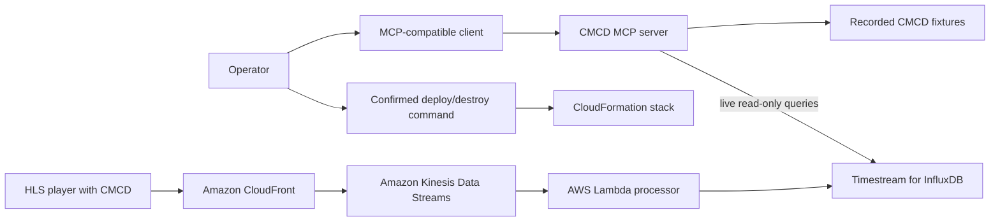

# CMCD MCP Server

Find viewer rebuffering, bitrate, startup, and session patterns from Common
Media Client Data (CMCD) without manually writing InfluxDB queries.

> [!IMPORTANT]
> This AWS sample is for educational and reference purposes. It requires
> security hardening, testing, and customization before production use.

## Purpose

Use this sample when a video operator needs evidence about viewer quality of
experience: which sessions buffered, where low-buffer events concentrated, and
whether startup delay or bitrate behavior indicates a playback incident.

The first successful run uses recorded telemetry, needs no AWS account, and
lets any MCP-compatible assistant report three low-buffer events concentrated
at one demo edge location and CDN.

## Architecture



The MCP entrypoint owns stdio transport and selects either fixtures or an
InfluxDB connection. Each tool delegates one read action to a focused
InfluxDB adapter and returns typed evidence. The MCP server exposes no write
tools.

For live use, the database stays in private subnets. The local MCP process
reaches it through an AWS Systems Manager port-forwarding session. Deployment
and teardown are separate, confirmed operations; they are not callable through
MCP.

## Prerequisites

For the local fixture demo:

- Python 3.12 or newer. `uv` installs the repository's Python version from
  `.python-version`.
- [`uv`](https://docs.astral.sh/uv/).
- [`just`](https://just.systems/), installed with
  `uv tool install rust-just`.
- An MCP-compatible client, such as Amazon Q CLI, Claude Desktop, Cursor, or
  another client that can launch a stdio server.

For the AWS-backed path, also provide:

- AWS CLI v2 and the Session Manager plugin.
- AWS credentials allowed to use CloudFormation, CloudFront, WAF, S3, KMS,
  Kinesis, Lambda, Timestream for InfluxDB, EC2/VPC, Systems Manager, Secrets
  Manager, SQS, IAM, and CloudWatch Logs.
- Service quota for a `db.influx.medium` Timestream for InfluxDB instance and
  the other resources above.
- An HLS playlist named `master.m3u8` and its media segments.
- Region `us-east-1`. The stack is pinned there because its CloudFront-scoped
  WAF web ACL must be created in `us-east-1`.

The AWS deployment creates billable resources, including CloudFront, Kinesis,
a `db.influx.medium` InfluxDB instance, a NAT gateway, and EC2.

Check the local tools:

```bash
python3 --version
uv --version
just --version
```

Before deployment, also check the AWS identity:

```bash
aws --version
session-manager-plugin --version
aws sts get-caller-identity
```

## Setup and Run

### Run Locally

1. Clone the repository and enter its root:

   ```bash
   git clone https://github.com/aws-samples/sample-agentic-video-operations.git
   cd sample-agentic-video-operations
   ```

2. Install `just`:

   ```bash
   uv tool install rust-just
   ```

3. Start the fixture-backed server:

   ```bash
   DEMO=1 just run cmcd
   ```

   Raw command:

   ```bash
   DEMO=1 uv run --package cmcd-mcp-server serve-cmcd
   ```

   A stdio MCP server waits silently for a client connection. Stop this smoke
   check with `Ctrl+C`; the client configuration in the next step launches the
   same command for you.

4. Add one of the following entries from
   [`mcp.json`](mcp.json) to your MCP client configuration. Replace the
   repository path with its absolute path:

   ```json
   {
     "mcpServers": {
       "cmcd": {
         "command": "uv",
         "args": [
           "run",
           "--directory",
           "/absolute/path/to/sample-agentic-video-operations",
           "--env-file",
           ".env",
           "--package",
           "cmcd-mcp-server",
           "serve-cmcd"
         ]
       },
       "cmcd-demo": {
         "command": "uv",
         "args": [
           "run",
           "--directory",
           "/absolute/path/to/sample-agentic-video-operations",
           "--package",
           "cmcd-mcp-server",
           "serve-cmcd"
         ],
         "env": {
           "DEMO": "1"
         }
       }
     }
   }
   ```

5. Restart the MCP client and send this known-good request to `cmcd-demo`:

   ```text
   Find CMCD buffer events below 500 ms in the last 24 hours. Summarize where
   they are concentrated.
   ```

   Expected result:

   ```text
   The assistant calls analyze_buffer_events and reports 5 total events,
   including 3 below 500 ms. All 3 low-buffer events are at demo-edge-west on
   demo-cdn.
   ```

### Deploy to AWS

1. From the repository root, create the shared configuration:

   ```bash
   cp .env.example .env
   ```

   The deployment uses your active AWS credentials. You may also set these
   optional values in the root `.env`:

   ```dotenv
   # Domain used only when adapting the template's custom origin.
   CMCD_ORIGIN_DOMAIN=example.com
   # Full, globally unique bucket name. Leave unset to use cmcd-content-<account id>.
   CMCD_S3_BUCKET_NAME=
   ```

2. Deploy the `video-ops-cmcd` CloudFormation stack:

   ```bash
   just deploy cmcd
   ```

   Raw command:

   ```bash
   uv run --env-file .env python scripts/manage_cmcd_stack.py deploy
   ```

   > [!WARNING]
   > This command creates billable AWS resources. Read the printed account,
   > region, stack, and cost-bearing services before confirming.

3. Upload an HLS playlist and its segments to the stack's content bucket:

   ```bash
   CMCD_BUCKET="$(aws cloudformation describe-stacks \
     --stack-name video-ops-cmcd \
     --region us-east-1 \
     --query "Stacks[0].Outputs[?OutputKey=='S3BucketName'].OutputValue" \
     --output text)"
   aws s3 cp /path/to/master.m3u8 \
     "s3://${CMCD_BUCKET}/videos/master.m3u8" \
     --region us-east-1
   aws s3 cp /path/to/hls-segments/ \
     "s3://${CMCD_BUCKET}/videos/" \
     --recursive \
     --region us-east-1
   ```

4. Print the generated connection commands and keep the printed Systems
   Manager tunnel running in another terminal:

   ```bash
   uv run python scripts/manage_cmcd_stack.py show-next-steps
   ```

5. Follow the printed command to read the InfluxDB admin password, then sign in
   at `https://localhost:8086`. Under **Load Data → API Tokens**, create a token
   with read-only access to the `cmcd-metrics` bucket.

   Use a least-privilege read-only token for this MCP server. Do not use an
   all-access token. The stack output named `InfluxDBToken` is setup material,
   not an InfluxDB API token.

6. Add the live connection to the root `.env`:

   ```dotenv
   INFLUXDB_URL=https://localhost:8086
   INFLUXDB_ORG=cmcd-org
   INFLUXDB_TOKEN=replace-with-the-read-only-api-token
   VERIFY_SSL=false
   ```

   `VERIFY_SSL=false` is only for this local tunnel: the certificate names the
   private InfluxDB host, not `localhost`. Keep verification enabled for
   connections whose certificate matches the configured hostname.

7. Open the `VideoPlayerURL` printed after deployment and play the HLS stream
   long enough to generate CMCD telemetry.

8. Start the live MCP server:

   ```bash
   just run cmcd
   ```

   Keep the Systems Manager tunnel from step 4 running while using the live
   server. Without it, the first tool call cannot reach InfluxDB and times out.

   Raw command:

   ```bash
   uv run --env-file .env --package cmcd-mcp-server serve-cmcd
   ```

### Verify the Deployment

Confirm that the stack completed:

```bash
aws cloudformation describe-stacks \
  --stack-name video-ops-cmcd \
  --region us-east-1 \
  --query "Stacks[0].StackStatus" \
  --output text
```

The expected status is `CREATE_COMPLETE` or `UPDATE_COMPLETE`.

Configure the `cmcd` MCP entry from the local-run section, restart the client,
and send:

```text
List the CMCD session and content IDs observed in the last 24 hours, then
analyze playback errors for the newest session.
```

Expected result:

```text
The assistant lists at least one session and the video-content-demo content
ID, then reports typed playback evidence for the selected session. If no data
appears, keep the player running and retry after the stream processor has
delivered records.
```

## Available Tools

| Tool | Read/write | What it does |
|---|---|---|
| `get_average_bitrate` | Read | Calculates mean requested bitrate, optionally by session or content |
| `get_session_details` | Read | Returns a chronological metric timeline for one session |
| `analyze_buffer_events` | Read | Finds buffer measurements below a requested threshold |
| `identify_playback_errors` | Read | Detects buffer underruns, sudden drops, and excessive startup delay |
| `list_session_and_content_ids` | Read | Lists distinct session and content identifiers |
| `execute_flux_query` | Read | Runs an explicitly read-only Flux query |

## Teardown

Stop the local MCP process and Systems Manager tunnel with `Ctrl+C`.

From the repository root, destroy the AWS resources:

```bash
just destroy cmcd
```

Raw command:

```bash
uv run python scripts/manage_cmcd_stack.py destroy
```

Before confirmation, the command lists the exact S3 bucket, CloudFormation
stack, retained InfluxDB instance, and Lambda log groups it will remove. It
then:

1. empties the content bucket;
2. deletes the `video-ops-cmcd` stack;
3. explicitly deletes the InfluxDB instance retained as a safety net by the
   template; and
4. deletes the stack's Lambda log groups.

If discovery or any deletion fails, the command stops and tells you to fix the
problem and run it again. InfluxDB deletion takes several minutes. Use the
identifier and verification command printed by teardown to confirm it reaches
`ResourceNotFoundException`.

Confirm the stack and log groups are gone:

```bash
aws cloudformation describe-stacks \
  --stack-name video-ops-cmcd \
  --region us-east-1
aws logs describe-log-groups \
  --region us-east-1 \
  --log-group-name-prefix /aws/lambda/video-ops-cmcd- \
  --query "logGroups[].logGroupName"
```

The first command should report that the stack does not exist, and the second
should return an empty list. KMS keys created by the stack remain scheduled for
AWS-managed deletion for 7–30 days; no manual action is required.

Delete the local `.env` if it is no longer needed because it contains the
InfluxDB API token. Orphaned infrastructure and retained data can continue to
incur cost.

## Known Limitations

- This is an educational sample, not a production-ready monitoring service.
- The MCP server runs locally over stdio; the CloudFormation stack deploys the
  telemetry pipeline, not a hosted MCP runtime.
- Live database access requires a local Systems Manager tunnel.
- The stack and template are tested only in `us-east-1`.
- The sample has no multi-tenant isolation, high-availability guarantee,
  backup policy, alerting, or complete retry and recovery strategy.
- The deployment creates long-running cost-bearing resources, especially
  Timestream for InfluxDB and the NAT gateway.
- The raw Flux tool applies a read-only safety policy, but database permissions
  remain the primary control; always use a bucket-scoped read-only token.
- Fixture playback covers one representative rebuffering incident, not every
  InfluxDB or CDN behavior.
- Tool results are deterministic for a given dataset, but an MCP client's
  model-generated explanation may vary.
- The provided IAM and network policies require a least-privilege production
  review.

## Development

Run the CMCD tests:

```bash
just test cmcd
```

Raw command:

```bash
uv run pytest samples/cmcd/tests
```

Run repository lint and formatting checks:

```bash
just lint
```

Raw commands:

```bash
uv run ruff check .
uv run ruff format --check .
```

Check README structure and relative links:

```bash
just docs-check
```

Raw command:

```bash
uv run python scripts/check_readme_structure.py
```

Keep each adapter focused on one external action, return typed results, and
cover behavior with root-level recorded fixtures.

## Contributing

Read [`AGENTS.md`](../../AGENTS.md) and
[`CONTRIBUTING.md`](../../CONTRIBUTING.md) before opening a pull request.

## Security

Never commit credentials, `.env` files, API tokens, account IDs, ARNs, or real
media resource IDs. Keep InfluxDB tokens read-only and bucket-scoped. Report
security issues through the process in
[`CONTRIBUTING.md`](../../CONTRIBUTING.md#security-issue-notifications).

## License

This project is licensed under the MIT No Attribution License. See
[`LICENSE`](../../LICENSE).
