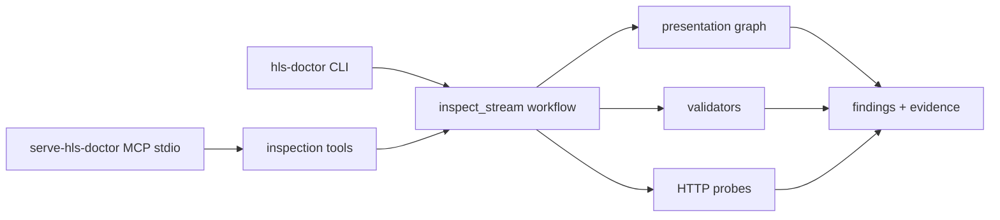

# HLS Doctor

Diagnose HTTP Live Streaming presentations from a single manifest URL: build
the presentation graph, validate protocol structure, probe delivery, and
explain likely causes with evidence instead of raw errors.

[](../../LICENSE)

## Purpose

HLS Doctor is an **agent toolset for HLS diagnosis**, not another validator.
Apple's `mediastreamvalidator` remains the conformance oracle - when it is
installed, HLS Doctor runs it and folds its report in as an independent
crosscheck. The value this sample adds sits on top of and around it:

- **Diagnosis over time**: a watch window catches what no single validation
  pass can - segments advertised before they exist, frozen playlists, stale
  CDN generations, renditions drifting apart.
- **Correlation across layers**: HTTP delivery evidence, playlist semantics,
  ffprobe timestamps, decoded SCTE-35 payloads and cross-rendition alignment
  are joined into one ranked diagnosis instead of four separate reports.
- **An agent surface**: every capability is a typed read-only tool. Plug the
  MCP server into Claude Code (or Amazon Q CLI, Kiro, any MCP client) and ask
  it to diagnose a stream; the same tools load into the agentic-iops-streaming agent,
  which deploys as a container on Amazon Bedrock AgentCore, so coordinator
  workflows and UIs drive the identical tooling.

Given an `.m3u8` URL, it recursively inspects every playlist beneath it,
validates HLS semantics (required tags, group references, rendition
declarations, encryption signaling, EXT-X-VERSION compatibility), probes the
delivery of playlists, segments, initialization sections and keys, and emits
findings that separate observed facts from interpretation:

```text
Finding: Unreachable init section
Evidence: Returned HTTP 404 at +42 ms
Playback impact: No segment of the rendition can be decoded.
```

A single failed request is evidence, not a root-cause conclusion: every
finding carries its observations, severity (impact) and confidence (evidence
strength) separately.

## Architecture



- `domain/` is framework-free: playlist tokenizer and typed parsers (unknown
  tags are preserved verbatim), presentation graph, validators, version rules,
  evidence store and findings.
- `adapters/http/` fetches live URLs with httpx, or replays recorded exchanges
  from `fixtures/` in demo mode. A missing recording fails closed.
- `tool_surface/` exposes the same read-only tools to the MCP server and to
  agentic-iops-streaming's `hls` domain pack.

## Prerequisites

- Python 3.12 or newer and [`uv`](https://docs.astral.sh/uv/).
- [`just`](https://just.systems/) (`uv tool install rust-just`).
- No AWS account and no credentials: this sample makes no AWS calls.

## Setup and Run

### Run Locally

1. Create the root configuration once:

   ```bash
   cp .env.example .env
   ```

2. Inspect the recorded demo presentation with no network access:

   ```bash
   DEMO=1 uv run --package hls-doctor hls-doctor inspect https://demo.example/vod/master.m3u8
   ```

3. Inspect a real stream (any reachable `.m3u8` URL):

   ```bash
   uv run --package hls-doctor hls-doctor inspect <manifest-url> --output json
   ```

   The exit code reflects the worst finding: 0 healthy, 1 warnings, 2 errors,
   3 fatal, 4 the URL itself was unusable.

4. Or serve the tools over MCP stdio:

   ```bash
   just run hls-doctor
   ```

   The raw command is `uv run --package hls-doctor serve-hls-doctor`.

Plug it into Claude Code with one command (run from the repository root):

   ```bash
   claude mcp add hls-doctor -e DEMO=0 -- uv run --directory "$PWD" --package hls-doctor serve-hls-doctor
   ```

   Then ask: *"Use hls-doctor to diagnose https://your-stream/master.m3u8 -
   watch it for 30 seconds and explain the findings."*

For other MCP clients, register `samples/hls-doctor/mcp.json`, replacing the
placeholder path with your clone:

```json
{
  "mcpServers": {
    "hls-doctor": {
      "command": "uv",
      "args": [
        "run",
        "--directory",
        "/absolute/path/to/sample-agentic-video-operations",
        "--env-file",
        ".env",
        "--package",
        "hls-doctor",
        "serve-hls-doctor"
      ]
    },
    "hls-doctor-demo": {
      "command": "uv",
      "args": [
        "run",
        "--directory",
        "/absolute/path/to/sample-agentic-video-operations",
        "--package",
        "hls-doctor",
        "serve-hls-doctor"
      ],
      "env": {
        "DEMO": "1",
        "DEMO_SCENARIO": "hls_segment_race",
        "ALLOW_WRITES": "false"
      }
    }
  }
}
```

Known-good request, using the `hls-doctor-demo` entry:

> Watch https://demo.example/live/master.m3u8 for a few seconds and explain any
> delivery problems.

Expected result: the agent calls `watch_playlist` and reports a publication
race: newly advertised segments returned 404 twice and became available about
1.3 s later, reproduced on two renditions, with the per-request evidence
timeline. Switch `DEMO_SCENARIO` to `hls_clean_vod` and ask for an inspection
instead: a healthy encrypted VOD presentation with zero errors.

### Deploy to AWS

This sample runs locally and creates no AWS infrastructure of its own. It is
also a read-only domain pack of [agentic-iops-streaming](../agentic-iops-streaming/README.md): deploy it
with `MEDIA_DOMAINS=medialive,mediaconnect,hls` and the agent gains the
HLS diagnostic tools with an empty IAM permission set. The runtime image
does not ship `ffprobe` (or the validator and Node harness), so the
deployed pack degrades to its non-probe tools: playlist, delivery and
watch diagnostics work fully; `probe_segment` reports that media probing
is unavailable.

### Verify the Deployment

For the local sample the known-good request above is the verification. For
an agentic-iops-streaming deployment that includes the `hls` domain, follow its README's
verification and ask its agent the known-good request.

## Available Tools

| Tool | Access | What it does |
|---|---|---|
| `inspect_stream` | read | Full pipeline: graph, validation, delivery probes, ranked findings |
| `fetch_manifest` | read | Fetch one URL and check it is plausibly an M3U8 playlist |
| `parse_playlist` | read | Parse one playlist into structure counts and unknown-tag lines |
| `map_presentation` | read | Resolve the full presentation graph and feature inventory |
| `probe_http` | read | One GET with status, timing and headers, recorded as evidence |
| `watch_playlist` | read | Reload live playlists over a bounded window; live defects and races |
| `probe_segment` | read | ffprobe one segment: streams, format, packet timestamps |
| `run_apple_validator` | read | Apple mediastreamvalidator conformance crosscheck |
| `decode_scte35` | read | Decode a base64 or hex SCTE-35 payload into splice structures |
| `compare_rendition_alignment` | read | Sequence, program-clock and event alignment across renditions |
| `inspect_interstitial` | read | Validate and probe interstitial events, asset lists and assets |
| `inspect_ll_hls` | read | LL-HLS probes: blocking reload, rendition reports, preload hints |
| `inspect_content_steering` | read | Steering manifest, pathway validation, per-pathway health |
| `run_player_probe` | read | Optional hls.js headless session (needs Node.js 20+ and npm install) |

## Demo Scenarios

`DEMO=1` replays recorded HTTP exchanges from `fixtures/`; no network access
happens and a URL without a recording fails closed. `DEMO_SCENARIO` selects
the incident:

| Scenario | What the inspection finds |
|---|---|
| `hls_segment_race` | Live: new segments 404 before becoming available (publication race) |
| `hls_clean_live` | Healthy live presentation; zero errors |
| `hls_frozen_playlist` | Live: the 1080p playlist stops advancing |
| `hls_stale_cdn_manifest` | Live: the CDN serves one stale generation with growing Age |
| `hls_signaled_gap` | Live: a missing segment correctly declared with EXT-X-GAP |
| `hls_pts_regression` | VOD: ffprobe shows PTS going backwards mid-segment |
| `hls_audio_drift` | Live: the audio program clock trails video by 2.1 s |
| `hls_missing_discontinuity` | Live: probed segments change codec with no discontinuity |
| `hls_cueout_without_cuein` | Live: an ad break opens and never returns to the program |
| `hls_scte35_duration_mismatch` | Live: the DATERANGE disagrees with its decoded SCTE-35 payload |
| `hls_interstitial_asset_404` | Live: the interstitial X-ASSET-LIST returns 404 |
| `hls_interstitial_bad_asset` | Live: the interstitial asset declares an undecodable codec |
| `hls_interstitial_rendition_mismatch` | Live: the interstitial is missing from the audio rendition |
| `hls_variant_lag` | Live: one variant publishes two segments behind its peers |
| `hls_clean_llhls` | Healthy Low-Latency HLS: parts, blocking reload, hints, reports |
| `hls_llhls_blocking_reload` | LL-HLS: the _HLS_msn blocking reload answers with a stale generation |
| `hls_stale_rendition_report` | LL-HLS: RENDITION-REPORT lags the actual rendition |
| `hls_preload_hint_404` | LL-HLS: the hinted part keeps returning 404 |
| `hls_steering_pathway_failure` | VOD: steering pathway B fails while pathway A serves |
| `hls_clean_vod` | Healthy encrypted VOD; zero errors |
| `hls_missing_variant` | One ABR variant playlist returns 404 |
| `hls_wrong_version` | EXT-X-VERSION:3 declared while v6 EXT-X-MAP syntax is in use |
| `hls_targetduration_exceeded` | A segment advertises 8.5 s against TARGETDURATION 6 |
| `hls_broken_map` | The initialization section returns 404 |
| `hls_expired_key` | The AES-128 key URL returns 403 with an expiry-shaped body |
| `hls_subtitle_playlist_404` | The subtitle rendition playlist returns 404 |

The scenarios are derived from the clean base by the deterministic mutations
in `scripts/hls_fixture_mutations.py`; `scripts/record_hls_fixtures.py`
records new bases from a live stream with hosts and query tokens redacted.

## Player Probe (optional)

`run_player_probe` plays the stream with [hls.js](https://github.com/video-dev/hls.js)
in headless Chromium and reports the player's events, errors and network
requests. It runs when Node.js 20+ is installed and `npm install` has been run
in `samples/hls-doctor/player-probe`; without them the tool reports exactly
what is missing, and every other check works normally.

## Teardown

Stop the CLI or MCP process with `Ctrl+C`. Nothing else was created.

## Known Limitations

- The inspection is a single snapshot: media playlists are fetched once, so
  live-edge behavior over time is outside one run's evidence.
- Delivery probing covers playlists, keys, initialization sections and
  representative segments; segment media content is not decoded.
- The report reflects what the probes observed from this network location;
  CDN behavior can differ per edge.

## Development

```bash
just test hls-doctor
just lint
just typecheck
```

The acceptance scenarios in `samples/hls-doctor/tests/scenarios` replay every
fixture incident through the full pipeline and assert the expected finding,
severity and confidence.

## Contributing

See [CONTRIBUTING.md](../../CONTRIBUTING.md). Keep changes offline-testable:
every new check needs a fixture scenario or a unit test with playlist
literals.

## Security

- The inspector is read-only; it sends only GET requests.
- Every fetch - including every redirect hop, and the URLs handed to ffprobe,
  the Apple validator and the player probe - passes an SSRF guard: only
  http(s) to hosts whose every resolved address is global unicast. Loopback,
  private, link-local and metadata addresses are refused. Set
  `HLS_ALLOW_PRIVATE_TARGETS=true` locally to diagnose a private stream; the
  deployed container refuses that override.
- Report sanitization is unconditional: every query value is redacted except
  the LL-HLS delivery directives, response headers pass an allowlist (never
  `Set-Cookie` or `x-amz-*`), evidence bodies are 1 KiB previews with a
  sha256, and key exchanges keep no body at all - only hash and length.
- Response bodies are read as bounded streams: a declared oversize body is
  not read, and chunked or compressed bodies stop at the decoded cap.
- ffprobe runs under an explicit protocol whitelist (`http,https,tcp,tls`
  for URLs; `file` only for the bytes the workflow itself just downloaded).
- Fetched content is treated as data, never as instructions: quoted remote
  text in findings is length-bounded and stripped of control characters, and
  the packaged skills instruct the agent accordingly.

## License

MIT No Attribution. See [LICENSE](../../LICENSE).
