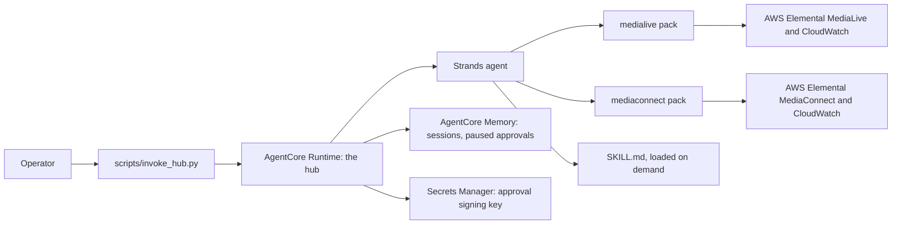

# Media Ops Hub

One agent that investigates live-video problems across AWS Elemental MediaLive and
MediaConnect, and asks an operator before it changes anything.

> [!IMPORTANT]
> This sample is for educational and reference purposes. It is not
> production-ready without security hardening, testing, and customization.

## Purpose

Use the hub when an operator needs to know why viewers see a problem, and where on the
signal path from MediaConnect flow to MediaLive channel it starts.

It is one Strands agent on Amazon Bedrock AgentCore. Each media service plugs in as a
**domain pack** (`samples/medialive`, `samples/mediaconnect`), chosen with `MEDIA_DOMAINS`.
The first successful run, `just demo`, replays a recorded input-loss incident through the
real hub and needs no AWS account.

## Architecture



- **Reads** run freely. **Writes** (start, stop, input switch, schedule actions) exist only
  with `ALLOW_WRITES=true`. They pause for an operator decision, are signed for exactly
  the approved action, and are verified after they run.
- **Events stream** as each happens: `task_started`, `tool_called`, `approval_requested`,
  `action_completed`, `verification_completed`, `final_answer`, `error`.
- The design is in [`docs/extend_the_hub.md`](../../docs/extend_the_hub.md).

### Trust model

- **Who may call the hub:** only principals your IAM allows to invoke the runtime. The
  stack outputs `InvokePolicyArn`, a policy that allows invoking this runtime and nothing
  else. Set `HUB_INVOKER_ROLE_NAME` in the root `.env` to attach it to one role at deploy.
- **Who the actor is:** the `X-Amzn-Bedrock-AgentCore-Runtime-Custom-Actor-Id` header.
  It is **supplied by the caller and not verified**. The hub uses it to keep one
  operator's pending approvals from another's, but any principal that may invoke can
  claim any actor id. Actor isolation therefore holds only among principals you trust to
  invoke. A request without the header is refused.
- **Next hardening step:** AgentCore inbound JWT authorization, with the actor taken from
  the verified token's `sub`. It is not implemented yet.

## Prerequisites

- Python 3.12 or newer (`uv` installs it from the root `.python-version`).
- [`uv`](https://docs.astral.sh/uv/) and [`just`](https://just.systems/)
  (`uv tool install rust-just`).
- For AWS: credentials for a non-production account, Node.js 20+, Docker, a CDK
  bootstrap in your `AWS_REGION`, and access to the Bedrock model in `AGENT_MODEL_ID`.

Check them:

```bash
just doctor        # offline checks
just doctor aws    # also AWS, Docker, CDK bootstrap
```

Raw command:

```bash
uv run python scripts/check_prerequisites.py
```

## Setup and Run

### Run Locally

1. Clone the repository and enter it:

   ```bash
   git clone https://github.com/aws-samples/sample-agentic-video-operations.git
   cd sample-agentic-video-operations
   ```

2. Replay the recorded incident. No AWS account and no Bedrock call are needed:

   ```bash
   just demo
   ```

   Raw command:

   ```bash
   uv run --package media-ops-hub demo-hub
   ```

   Expected result: the hub calls `list_channels`, `load_skill`, `check_channel_issues`
   and `read_channel_logs`, then answers that pipeline 0 of `demo-channel` lost its SRT
   input.

3. Run the hub server locally with a real model (Bedrock is billed). Copy and edit the root
   `.env` first:

   ```bash
   cp .env.example .env    # set AGENT_MODEL_ID; DEMO=1 keeps AWS reads on fixtures
   just run hub
   ```

   It listens on `http://localhost:8080` (`/ping`, `/invocations`).

### Deploy to AWS

> [!WARNING]
> Deployment creates billable AgentCore Runtime and Memory, a Secrets Manager secret,
> Bedrock usage and an ECR image. Confirm the account and region the command prints.

```bash
just deploy hub
```

Raw command:

```bash
uv run python scripts/manage_hub_stack.py deploy
```

- `MEDIA_DOMAINS` (default `medialive,mediaconnect`) selects the packs. IAM comes from
  each pack's `iam_permissions.json`. Write permissions are added only with
  `ALLOW_WRITES=true`.
- Outputs: `AgentRuntimeArn`, `AgentRuntimeId`, `AgentEndpointName`, `MemoryId`,
  `MediaDomains`, `InvokePolicyArn`.

### Verify the Deployment

```bash
uv run python scripts/invoke_hub.py --actor <your-operator-id> "List my MediaLive channels"
```

Expected result: `task_started`, `tool_called` (`list_channels`), then a `final_answer`
listing your channels. A paused write prints an `approval_requested` event; answer it
with `--session <id> --approve <approval_id>` (or `--reject`).

## Teardown

```bash
just destroy hub
```

Raw command:

```bash
uv run python scripts/manage_hub_stack.py destroy
```

It deletes the stack (runtime, endpoint, memory, signing-key secret, roles, invoke
policy) and the log groups of this runtime only. If a step fails, it prints exactly what
remains. The CDK bootstrap ECR repository may keep the hub image; remove it there if
unused.

## Known Limitations

- **Actor ids are not authenticated.** See the trust model above. Inbound JWT
  authorization is the next hardening step.
- **The demo is scripted.** `just demo` uses a scripted model over synthetic fixtures; it
  shows the plumbing, not model quality.
- **One hub per account and region:** the runtime name is fixed.
- **Not covered by the offline tests:** the container build and a real deployment. Run
  `just deploy hub` in a sandbox account to check them.

## Development

```bash
just test hub
just lint
just docs-check
cd samples/hub/cdk && npm ci && npm test && npx cdk synth --quiet
```

## Contributing

Read the root [`AGENTS.md`](../../AGENTS.md) and
[`CONTRIBUTING.md`](../../CONTRIBUTING.md) before opening a pull request.

## Security

Never commit `.env` files, account ids, ARNs, or real channel and flow ids. Report
security issues through the process in
[`CONTRIBUTING.md`](../../CONTRIBUTING.md#security-issue-notifications).

## License

This project is licensed under the MIT No Attribution License. See
[`LICENSE`](../../LICENSE).
