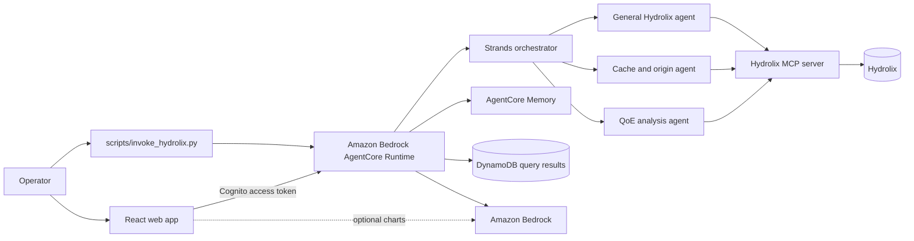

# Hydrolix CDN Insights

Ask natural-language questions about CDN delivery, origin performance, and
viewer QoE data stored in Hydrolix.

> [!IMPORTANT]
> This sample is for educational and reference purposes. It is not
> production-ready without security hardening, testing, and customization.


## Purpose

Use this sample when an operator or analyst needs to explore high-volume CDN
and streaming telemetry without writing each SQL query by hand.

An orchestrator routes a question to one of three focused Strands subagents:

| Agent | Focus |
|---|---|
| `hydrolix_agent` | General traffic and time-series analysis |
| `cache_origin_agent` | Cache efficiency, origin latency, errors, and edge locations |
| `qoe_analysis_agent` | CMCD, rebuffering, bitrate, throughput, and viewer experience |

The first verified result deploys the AgentCore backend, connects it to a
Hydrolix table, and invokes it directly with the AWS CLI. The React web
interface is optional and remains a manual setup.

## Architecture



The CDK stack packages the runtime as a container image, deploys AgentCore
Runtime and Memory, creates the DynamoDB results table and a generated
Secrets Manager secret, and passes the selected reasoning model and Hydrolix
table to the runtime. During deployment, the management script copies the
Hydrolix MCP package from one pinned upstream commit into the ignored Docker
build context. It also copies the upstream Apache-2.0 `LICENSE` and any
`NOTICE` file beside that package so the built image preserves its terms.


### Trust model

The assistant keeps each user's conversation in AgentCore Memory under an actor id. Where
that id comes from depends on how the backend is deployed. A runtime accepts IAM callers
or bearer tokens, never both.

| | JWT (`HYDROLIX_JWT_DISCOVERY_URL` and `HYDROLIX_JWT_CLIENT_IDS` set) | IAM (neither set) |
|---|---|---|
| Who may call | Holders of a current Cognito access token from that user pool, issued to one of those app clients. AgentCore verifies the signature, issuer, expiry and `client_id` before the request reaches the agent. | Principals your IAM allows to invoke the runtime. |
| Who the actor is | The token's `sub`. The runtime forwards only the `Authorization` header; a `user_id` in the request is ignored. | Nobody. There is no verified identity, so **memory is off**: no history is read or kept, and every response starts with a notice saying so. |
| Which conversation | The AgentCore runtime session id, never a request field. The first user a session's microVM serves owns it; another user's token on that session is refused. Memory is also keyed by user and session, so a session id reused later reaches only its own user's history. | The runtime session id; memory is off. |
| Logs | Counts and lengths only: no question, answer, SQL, user id or session id, in the runtime and in the browser console (the web app logs through `samples/hydrolix/amplify-hydrolix-data-assistant-agentcore-strands/src/utils/logMetadata.js` only). | Same. |
| What the model may query | Only `HYDROLIX_TABLE`, which can't be in `system` or `information_schema`. The subagents get `run_select_query` and `get_table_info`, not `list_databases` or `list_tables`. Before a call reaches the cluster, the runtime parses its SQL (sqlglot 26.33.0, pinned, ClickHouse dialect) and refuses anything but one `SELECT` that reads that table: every `SELECT` reads `FROM` the table, a subquery, or a CTE that itself reads the table. Functions must be on an allowlist of aggregates, date and time, math, string and URL, conditional, conversion, array and JSON functions, so server introspection such as `currentUser()` or `getSetting()` is refused. Also refused: another database or table, table functions (`url`, `s3`, `remote`, `file`, `cluster`, …), `VALUES`, `IN <table>`, `joinGet`/`dictGet`, a `SETTINGS` clause, a second statement, or SQL it can't parse. A refused query never runs and isn't saved to the results table. | Same. |
| Which Bedrock model the runtime may call | Only `AGENT_MODEL_ID`: for a cross-Region profile id (`us.`, `eu.`, `apac.`, `global.` …), that profile in this account and region plus the foundation model behind it in any region, as cross-Region inference requires; for a bare model id, that model only. The stack derives the model from the one `BedrockModelId` parameter, which accepts only `provider.model` or `<prefix>.provider.model`, so no value can name another model or a wildcard. `just deploy hydrolix` sets it from `AGENT_MODEL_ID` as the parameter's default (`-c agentModelId`), for the security diff and the deploy alike, and the confirmation names the model it grants. | Same. |
| How much the model may do | 16 tool calls and 180 seconds per request, counted from when the request arrives, for the orchestrator and its subagents together. The Secrets Manager read, the MCP start, every subagent run and the orchestrator's own answer all count against the 180 seconds. At the deadline the response ends with a "stopped" error and each subagent's Hydrolix MCP process is ended (terminated, or killed if its client can't stop it). Not everything stops at that instant: a model call or Secrets Manager read already in flight runs on in the background until that one call returns, and its result is never used. An MCP call that has already started is counted once and then cancelled when its client closes. Any tool call after the deadline is refused. The request's `user_timezone` goes into the system prompts only if it is a real IANA zone name, UTC otherwise. | Same. |

- **The agent doesn't re-verify the token signature.** AgentCore already has, and the
  agent reads the claims only when `HYDROLIX_JWT_ISSUER` is set, which only the CDK sets,
  and only on a JWT-authorized runtime. It still re-checks the issuer, client, expiry and
  subject, and fails closed if they disagree with its settings.
- **Query records are per user and only written.** Each query a subagent ran is recorded
  after it ran, with its status (a refused query never ran, so it isn't recorded). The
  response stream's last record is always that request's `{"query_results": [...]}`, also
  when the request stopped at its deadline or failed (the error comes just before it); the
  web app shows those queries and then the error. No browser role reads the results table.
  The runtime writes each record under the verified `sub` (partition key) with a
  millisecond timestamp and a unique suffix (sort key), and its role can only `PutItem`. In
  IAM mode nothing is written, as with memory. SQL is capped at 16,000 characters and the
  purpose and question at 4,000; a cut is recorded as `truncated` and `omitted_characters`,
  never as text in the value. A `prompt_uuid` that isn't a UUID is replaced by one, so a
  record always fits one item; a failed write is logged by class and the answer goes on.

## Prerequisites

- Python 3.12 or newer (`uv` installs it from the root `.python-version`).
- [`uv`](https://docs.astral.sh/uv/).
- [`just`](https://just.systems/), installed with `uv tool install rust-just`.
- Node.js 20 or newer and npm.
- Docker running for the AgentCore container build.
- Git and network access to fetch the pinned Hydrolix MCP source.
- AWS CLI credentials for a non-production account.
- An AWS CDK bootstrap in the target account and region.
- Access to the Bedrock model selected by `AGENT_MODEL_ID`.
- A Hydrolix cluster, a table in `database.table` form, and a **query-only
  Hydrolix user that can read that table and nothing else**. Its credentials go in
  the generated secret (Deploy step 6). The runtime's own SQL check (see the trust
  model) is a second line, not a substitute for the user's grants.
- For the optional UI: the Amplify Gen 1 CLI and permission to create Amplify
  and Cognito resources.

Check the repository prerequisites:

```bash
just doctor
```

Raw command:

```bash
uv run python scripts/check_prerequisites.py
```

## Setup and Run

### Run Locally

This sample has no fixture-backed local data mode. The safe local first run
installs the CDK dependencies, runs the offline tests, and synthesizes the
backend without creating AWS resources.

Clone the repository and enter its root:

```bash
git clone https://github.com/aws-samples/sample-agentic-video-operations.git
cd sample-agentic-video-operations
```

1. Create the one root configuration. The offline steps below need no values
   in it; the deployment section says which ones to set:

   ```bash
   cp .env.example .env
   ```

2. Install `just`:

   ```bash
   uv tool install rust-just
   ```

3. Run the offline Hydrolix management tests:

   ```bash
   just test hydrolix
   ```

   Raw command:

   ```bash
   uv run pytest scripts/tests/test_*hydrolix*.py
   ```

4. Synthesize the CDK backend with its safe template defaults:

   ```bash
   cd samples/hydrolix/cdk-hydrolix-data-assistant-agentcore-strands
   npm ci --no-audit --no-fund
   npx cdk synth CdkHydrolixDataAssistantAgentcoreStrandsStack
   cd ../../..
   ```

   Success writes a synthesized template under the ignored `cdk.out/`
   directory and exits with status 0.

### Deploy to AWS

> [!WARNING]
> Deployment creates billable AgentCore, ECR, DynamoDB, Secrets Manager, and
> logging resources. Confirm the account and region printed by the command.

1. Create the root configuration, if Run Locally step 1 hasn't already:

   ```bash
   cp .env.example .env
   ```

   Set these deployment values in `.env`, and uncomment `HYDROLIX_TABLE`:

   ```dotenv
   AWS_REGION=us-west-2
   AGENT_MODEL_ID=us.anthropic.claude-sonnet-4-6
   CHART_MODEL_ID=us.anthropic.claude-haiku-4-5-20251001-v1:0
   HYDROLIX_TABLE=your_database.your_table
   ```

   `HYDROLIX_TABLE` is the only table the agents can read. It must be `database.table`, with
   neither part starting with `_`, and not in `system` or `information_schema`; the stack
   parameter and the runtime both refuse anything else.

   `AGENT_MODEL_ID` powers the orchestrator and all three reasoning agents.
   `CHART_MODEL_ID` is used only by the optional browser UI. Add
   `HYDROLIX_AMPLIFY_APP_ID` only if teardown should remove an Amplify Hosting
   app that you created separately.

2. If the target environment has not been bootstrapped, bootstrap it once. The first
   command installs the CDK app's pinned CDK:

   ```bash
   set -a
   source .env
   set +a
   AWS_ACCOUNT_ID="$(aws sts get-caller-identity --query Account --output text)"
   cd samples/hydrolix/cdk-hydrolix-data-assistant-agentcore-strands
   npm ci --no-audit --no-fund
   npx cdk bootstrap "aws://$AWS_ACCOUNT_ID/$AWS_REGION"
   cd ../../..
   unset AWS_ACCOUNT_ID
   ```

3. Create the sign-in first, so the backend can trust it. In
   `samples/hydrolix/amplify-hydrolix-data-assistant-agentcore-strands/`, run
   `amplify init`, `amplify add auth` and `amplify push` (Amplify Gen 1). Then put the
   user pool's discovery URL and the web app client id in the root `.env`:

   ```dotenv
   HYDROLIX_JWT_DISCOVERY_URL=https://cognito-idp.<region>.amazonaws.com/<user-pool-id>/.well-known/openid-configuration
   HYDROLIX_JWT_CLIENT_IDS=<app client id>
   ```

   With both set, the runtime accepts only that pool's access tokens and keeps memory per
   user. Without them it is IAM-authorized and runs with memory off (see the trust model).

4. Deploy the backend:

   ```bash
   just deploy hydrolix
   ```

   Raw command:

   ```bash
   uv run python scripts/manage_hydrolix_stack.py deploy
   ```

   The command checks the CDK bootstrap (the CDKToolkit stack, its qualifier against the
   app's and its version), installs the CDK dependencies and prints the security changes
   the deploy makes (`cdk diff --security-only`, from templates: no image is built). The
   deploy stops unless CDK printed its result for this stack: the changes, or "no
   security-related changes". It then asks once. Only after that does it fetch the pinned
   MCP source, build and deploy, with CDK set to `--require-approval never`, so nothing stops halfway
   to ask again. `--yes` answers that one prompt, and the plan says so. Without a terminal
   and without `--yes`, it stops at the prompt: "No terminal: re-run with --yes after
   reviewing the plan above".

5. Read the generated Hydrolix secret ARN:

   ```bash
   set -a
   source .env
   set +a
   HYDROLIX_SECRET_ARN="$(
     aws cloudformation describe-stacks \
       --stack-name CdkHydrolixDataAssistantAgentcoreStrandsStack \
       --region "$AWS_REGION" \
       --query "Stacks[0].Outputs[?OutputKey=='HydrolixSecretArn'].OutputValue" \
       --output text
   )"
   ```

6. In AWS Secrets Manager, open that ARN and replace the placeholder secret
   with these four fields. Do not paste credentials into a terminal, issue, or
   chat:

   ```json
   {
     "HYDROLIX_HOST": "your-cluster.example.com",
     "HYDROLIX_PORT": "8088",
     "HYDROLIX_USER": "your-query-user",
     "HYDROLIX_PASSWORD": "replace-in-secrets-manager"
   }
   ```

   `HYDROLIX_USER` must be the query-only user from the prerequisites, granted read on
   `HYDROLIX_TABLE` alone. The agents never need another table, a system table or a
   table function.

### Verify the Deployment

1. On a JWT-authorized backend, put a current access token for a test user of the user
   pool in `HYDROLIX_BEARER_TOKEN` (root `.env` or the shell, never a command-line
   argument). For example, sign in to the web app, or use `aws cognito-idp initiate-auth`
   with a test app client that allows the `USER_PASSWORD_AUTH` flow. An IAM-authorized
   backend needs no token.

2. Send a known-good request:

   ```bash
   uv run python scripts/invoke_hydrolix.py \
     "What is the current cache hit rate, and which edge locations need attention?"
   ```

   The script reads the stack outputs and sends the token over HTTPS to a JWT backend,
   or calls `InvokeAgentRuntime` with your AWS credentials on an IAM backend. Add
   `--session <id>` (33 characters or more) to continue a conversation.

   Expected result:

   ```text
   The orchestrator selects the cache and origin specialist, queries the
   configured Hydrolix table, and returns evidence about cache efficiency and
   edge locations. If the table lacks those columns, it explains which schema
   or data is missing instead of inventing values.
   ```

### Optional Web Interface

The React application under
[`amplify-hydrolix-data-assistant-agentcore-strands/`](amplify-hydrolix-data-assistant-agentcore-strands/)
is not deployed by `just deploy hydrolix`.

Its Cognito sign-in is the one created in Deploy to AWS step 3. Copy
`samples/hydrolix/amplify-hydrolix-data-assistant-agentcore-strands/src/sample.env.js`
to an `env.js` file in the same directory and fill in the `AgentRuntimeArn` and
`AgentEndpointName` stack outputs. The app calls the runtime over HTTPS with the signed-in
user's access token and gets the queries it ran in the same response, so the
authenticated Cognito role needs only the chart-model invocation permission: no runtime
invocation and no DynamoDB access. Remove any DynamoDB permission an earlier version of
this README had you add to that role.

Start it locally with:

```bash
cd samples/hydrolix/amplify-hydrolix-data-assistant-agentcore-strands
npm ci
set -a
source ../../../.env
set +a
npm start
```

If you create an Amplify Hosting app, add its app ID to
`HYDROLIX_AMPLIFY_APP_ID` in the root `.env` so the repository teardown can
delete it.

## Teardown

Stop local processes with `Ctrl+C`.

From the repository root, destroy the backend and any configured Amplify
Hosting app:

```bash
just destroy hydrolix
```

Raw command:

```bash
uv run python scripts/manage_hydrolix_stack.py destroy
```

The confirmed teardown deletes the AgentCore runtime, endpoint and memory,
the query-records DynamoDB table, generated Hydrolix secret, stack roles, and an Amplify app
named by `HYDROLIX_AMPLIFY_APP_ID`. It leaves the earlier results table in place by design
(see below) and prints the command to delete it. If you created Cognito or other Amplify
backend resources manually, run `amplify delete` from the React application
directory first.

The CDK bootstrap ECR repository can retain the backend asset image after the
stack is gone. Inspect that shared repository and remove only this sample's
unused image if you no longer need it.

Confirm the stack is gone:

```bash
set -a
source .env
set +a
aws cloudformation describe-stacks \
  --stack-name CdkHydrolixDataAssistantAgentcoreStrandsStack \
  --region "$AWS_REGION"
```

The command should report that the stack does not exist. Orphaned AgentCore,
Amplify, Cognito, ECR, or database resources can continue to incur cost.

### The earlier results table

Versions before per-user query records kept the results in a table keyed by
`prompt_uuid`. Upgrading never deletes it, in two steps:

1. **This version** keeps that table in the stack exactly as it was (logical id
   `RawQueryResults82B00746`, same keys, so it is not replaced), changes only its deletion
   policy to `Retain`, and grants it to no role. Nothing writes or reads it any more; the new
   per-user table is separate.
2. **A later version** drops it from the template, and CloudFormation then removes it
   from the stack without deleting it. (CloudFormation applies the deletion policy of the
   template that is already deployed, which is why step 1 comes first.)

`just destroy hydrolix` leaves it in place too. Its name follows
`CdkHydrolixDataAssistantAgentcoreStrandsStack-RawQueryResults82B00746-<suffix>` and is the
stack's `RetiredQueryResultsTableName` output. When you no longer need its history, delete
it yourself; no script in this repository does:

```bash
RETIRED_TABLE="$(
  aws cloudformation describe-stacks \
    --stack-name CdkHydrolixDataAssistantAgentcoreStrandsStack \
    --region "$AWS_REGION" \
    --query "Stacks[0].Outputs[?OutputKey=='RetiredQueryResultsTableName'].OutputValue" \
    --output text
)"
aws dynamodb delete-table --region "$AWS_REGION" --table-name "$RETIRED_TABLE"
```

After the stack is destroyed, `just destroy hydrolix` prints this delete command with the
table's name filled in.

## Known Limitations

- This is an educational sample, not a production-ready analytics service.
- There is no fixture-backed offline Hydrolix demo; agent verification needs a
  reachable Hydrolix cluster and AWS deployment.
- The deployment command creates the backend only. Amplify, Cognito, browser
  configuration, and authenticated-role permissions remain manual.
- **Live verification pending:** the browser's direct HTTPS call to the AgentCore runtime with
  a bearer token (CORS). If a browser can't make it, the fallback is to keep SigV4 for the
  call and verify the Cognito token in the agent instead, as a separate change.
- With IAM authorization the assistant has no memory: there is no verified identity to
  keep a conversation under.
- The browser application uses deprecated Create React App tooling.
- The runtime's Python requirements are not pinned to exact versions. The
  Hydrolix MCP dependencies follow the version ranges of the pinned release.
- The pinned Hydrolix MCP release logs a deprecation warning for
  `HYDROLIX_HOST` and `HYDROLIX_PORT`, which the agents pass from the secret.
  They still work over stdio.
- Bedrock model invocation remains broad across foundation models and inference
  profiles; production deployments should restrict it to the selected model.
- Runtime writes are limited to its own DynamoDB table (`PutItem` only), AgentCore memory, and
  runtime log groups. The runtime can pull only from the CDK asset repository
  and has no ECR push permissions.
- The generated secret starts with placeholders and must be updated before the
  first live query.
- The UI invokes a chart model directly and has no configured Bedrock
  Guardrail.
- The chart model's output is data, never code: a chart formatter must be one of the
  names
  `samples/hydrolix/amplify-hydrolix-data-assistant-agentcore-strands/src/utils/chartFormatters.js`
  implements; anything else is dropped. Answers are sanitized before they render
  (`samples/hydrolix/amplify-hydrolix-data-assistant-agentcore-strands/src/utils/markdownSchema.js`):
  no scripts or frames, no
  images (a markdown image would send data to its host with no click), and links only to
  http(s) pages, opened with `rel="noopener noreferrer"`.
- The runtime's SQL check is a parser allowlist on what the model sends, not the
  database's permissions. ClickHouse syntax it doesn't parse is refused, and the Hydrolix
  user's grants remain the boundary that holds if the check misses something.
- Model-generated analysis is nondeterministic and must be checked against the
  returned query evidence.
- High availability, multi-tenant isolation, load testing, alerting, backup,
  and complete retry/recovery behavior are outside this sample.

## Development

Run the offline repository checks:

```bash
just test hydrolix
just lint
just docs-check
```

Validate the CDK app:

```bash
cd samples/hydrolix/cdk-hydrolix-data-assistant-agentcore-strands
npm ci --no-audit --no-fund
npm test -- --runInBand
npm run build
npx cdk synth CdkHydrolixDataAssistantAgentcoreStrandsStack
```

Keep the deployment wrapper thin, never log secret values, and update this
README whenever prerequisites, model settings, deployed resources, or
teardown behavior changes.

## Contributing

Read the root [`AGENTS.md`](../../AGENTS.md) and
[`CONTRIBUTING.md`](../../CONTRIBUTING.md) before opening a pull request.

## Security

Never commit Hydrolix credentials, `.env` files, account IDs, ARNs, generated
Amplify configuration, or real customer data. Use the query-only Hydrolix user the
prerequisites require, and a non-production AWS account.

Report security issues through the process in
[`CONTRIBUTING.md`](../../CONTRIBUTING.md#security-issue-notifications).

## License

This project is licensed under the MIT No Attribution License. See
[`LICENSE`](../../LICENSE). The container also redistributes
[`mcp-hydrolix` v0.3.7](https://github.com/hydrolix/mcp-hydrolix/tree/v0.3.7),
which is licensed under Apache-2.0; its upstream license and notice files are
copied into the image with its source.
