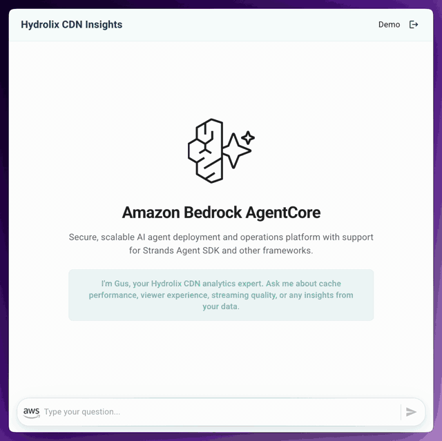
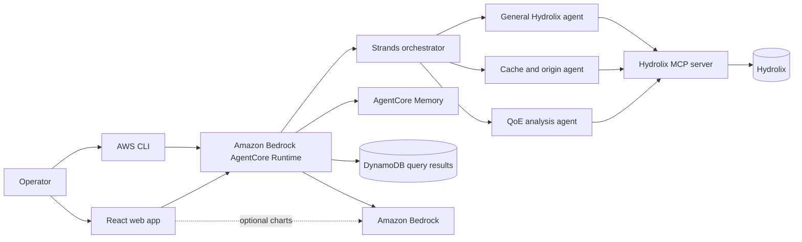
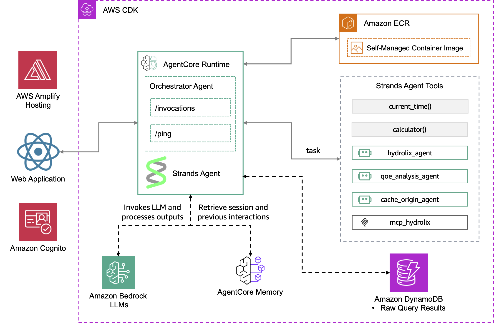

# Hydrolix CDN Insights

Ask natural-language questions about CDN delivery, origin performance, and
viewer QoE data stored in Hydrolix.

> [!IMPORTANT]
> This sample is for educational and reference purposes. It is not
> production-ready without security hardening, testing, and customization.



## Purpose

Use this sample when an operator or analyst needs to explore high-volume CDN
and streaming telemetry without writing each SQL query by hand.

An orchestrator routes a question to one of three focused Strands subagents:

| Agent | Focus |
|---|---|
| `hydrolix_agent` | General traffic and time-series analysis |
| `cache_origin_agent` | Cache efficiency, origin latency, errors, and edge locations |
| `qoe_analysis_agent` | CMCD, rebuffering, bitrate, throughput, and viewer experience |

The first verified result deploys the AgentCore backend, connects it to a
Hydrolix table, and invokes it directly with the AWS CLI. The React web
interface is optional and remains a manual setup.

## Architecture



The CDK stack packages the runtime as a container image, deploys AgentCore
Runtime and Memory, creates the DynamoDB results table and a generated
Secrets Manager secret, and passes the selected reasoning model and Hydrolix
table to the runtime. During deployment, the management script copies the
Hydrolix MCP package from one pinned upstream commit into the ignored Docker
build context.



## Prerequisites

- Python 3.12 or newer (`uv` installs it from the root `.python-version`).
- [`uv`](https://docs.astral.sh/uv/).
- [`just`](https://just.systems/), installed with `uv tool install rust-just`.
- Node.js 20 or newer and npm.
- Docker running for the AgentCore container build.
- Git and network access to fetch the pinned Hydrolix MCP source.
- AWS CLI credentials for a non-production account.
- An AWS CDK bootstrap in the target account and region.
- Access to the Bedrock model selected by `AGENT_MODEL_ID`.
- A Hydrolix cluster, a table in `database.table` form, and credentials that
  can query it.
- For the optional UI: the Amplify Gen 1 CLI and permission to create Amplify
  and Cognito resources.

Check the repository prerequisites:

```bash
just doctor
```

Raw command:

```bash
uv run python scripts/check_prerequisites.py
```

## Setup and Run

### Run Locally

This sample has no fixture-backed local data mode. The safe local first run
installs the CDK dependencies, runs the offline tests, and synthesizes the
backend without creating AWS resources.

1. Clone the repository and enter it:

   ```bash
   git clone https://github.com/aws-samples/sample-agentic-video-operations.git
   cd sample-agentic-video-operations
   ```

2. Install `just` and create the root configuration:

   ```bash
   uv tool install rust-just
   cp .env.example .env
   ```

3. Set these values in the root `.env`:

   ```dotenv
   AWS_REGION=us-west-2
   AGENT_MODEL_ID=us.anthropic.claude-sonnet-4-6
   CHART_MODEL_ID=us.anthropic.claude-haiku-4-5-20251001-v1:0
   HYDROLIX_TABLE=your_database.your_table
   ```

   `AGENT_MODEL_ID` powers the orchestrator and all three reasoning agents.
   `CHART_MODEL_ID` is used only by the optional browser UI.

4. Run the offline Hydrolix management tests:

   ```bash
   just test hydrolix
   ```

   Raw command:

   ```bash
   uv run pytest scripts/tests/test_manage_hydrolix_stack.py
   ```

5. Synthesize the CDK backend:

   ```bash
   set -a
   source .env
   set +a
   cd samples/hydrolix/cdk-hydrolix-data-assistant-agentcore-strands
   npm ci --no-audit --no-fund
   npx cdk synth CdkHydrolixDataAssistantAgentcoreStrandsStack \
     --parameters "BedrockModelId=$AGENT_MODEL_ID" \
     --parameters "HydrolixTable=$HYDROLIX_TABLE"
   cd ../../..
   ```

   Success writes a synthesized template under the ignored `cdk.out/`
   directory and exits with status 0.

### Deploy to AWS

> [!WARNING]
> Deployment creates billable AgentCore, ECR, DynamoDB, Secrets Manager, and
> logging resources. Confirm the account and region printed by the command.

1. If the target environment has not been bootstrapped, bootstrap it once. The first
   command installs the CDK app's pinned CDK:

   ```bash
   set -a
   source .env
   set +a
   AWS_ACCOUNT_ID="$(aws sts get-caller-identity --query Account --output text)"
   cd samples/hydrolix/cdk-hydrolix-data-assistant-agentcore-strands
   npm ci --no-audit --no-fund
   npx cdk bootstrap "aws://$AWS_ACCOUNT_ID/$AWS_REGION"
   cd ../../..
   unset AWS_ACCOUNT_ID
   ```

2. Deploy the backend:

   ```bash
   just deploy hydrolix
   ```

   Raw command:

   ```bash
   uv run python scripts/manage_hydrolix_stack.py deploy
   ```

   The command asks for confirmation, installs the pinned MCP source and CDK
   dependencies, then deploys with approval required for IAM broadening.
   `--yes` skips the repository confirmation and passes CDK
   `--require-approval never`.

3. Read the generated Hydrolix secret ARN:

   ```bash
   set -a
   source .env
   set +a
   HYDROLIX_SECRET_ARN="$(
     aws cloudformation describe-stacks \
       --stack-name CdkHydrolixDataAssistantAgentcoreStrandsStack \
       --region "$AWS_REGION" \
       --query "Stacks[0].Outputs[?OutputKey=='HydrolixSecretArn'].OutputValue" \
       --output text
   )"
   ```

4. In AWS Secrets Manager, open that ARN and replace the placeholder secret
   with these four fields. Do not paste credentials into a terminal, issue, or
   chat:

   ```json
   {
     "HYDROLIX_HOST": "your-cluster.example.com",
     "HYDROLIX_PORT": "8088",
     "HYDROLIX_USER": "your-query-user",
     "HYDROLIX_PASSWORD": "replace-in-secrets-manager"
   }
   ```

### Verify the Deployment

1. Read the runtime ARN and create a session ID:

   ```bash
   AGENT_RUNTIME_ARN="$(
     aws cloudformation describe-stacks \
       --stack-name CdkHydrolixDataAssistantAgentcoreStrandsStack \
       --region "$AWS_REGION" \
       --query "Stacks[0].Outputs[?OutputKey=='AgentRuntimeArn'].OutputValue" \
       --output text
   )"
   SESSION_ID="hydrolix-$(uv run python -c 'import uuid; print(uuid.uuid4())')"
   ```

2. Send a known-good request:

   ```bash
   aws bedrock-agentcore invoke-agent-runtime \
     --agent-runtime-arn "$AGENT_RUNTIME_ARN" \
     --runtime-session-id "$SESSION_ID" \
     --payload "$(
       printf '%s' \
         '{"prompt":"What is the current cache hit rate, and which edge locations need attention?"}' \
         | base64
     )" \
     --region "$AWS_REGION" \
     --cli-read-timeout 300 \
     output.json
   cat output.json
   ```

   Expected result:

   ```text
   The orchestrator selects the cache and origin specialist, queries the
   configured Hydrolix table, and returns evidence about cache efficiency and
   edge locations. If the table lacks those columns, it explains which schema
   or data is missing instead of inventing values.
   ```

### Optional Web Interface

The React application under
[`amplify-hydrolix-data-assistant-agentcore-strands/`](amplify-hydrolix-data-assistant-agentcore-strands/)
is not deployed by `just deploy hydrolix`.

To use it, initialize an Amplify Gen 1 project in that directory, add Cognito
authentication, run `amplify push`, copy `src/sample.env.js` to `src/env.js`,
and fill in the `QuestionAnswersTableName`, `AgentRuntimeArn`, and
`AgentEndpointName` stack outputs. Grant the authenticated Cognito role only
the required DynamoDB query, AgentCore runtime invocation, and chart-model
invocation permissions.

Start it locally with:

```bash
cd samples/hydrolix/amplify-hydrolix-data-assistant-agentcore-strands
npm install
set -a
source ../../../.env
set +a
npm start
```

If you create an Amplify Hosting app, add its app ID to
`HYDROLIX_AMPLIFY_APP_ID` in the root `.env` so the repository teardown can
delete it.

## Teardown

Stop local processes with `Ctrl+C`.

From the repository root, destroy the backend and any configured Amplify
Hosting app:

```bash
just destroy hydrolix
```

Raw command:

```bash
uv run python scripts/manage_hydrolix_stack.py destroy
```

The confirmed teardown deletes the AgentCore runtime, endpoint and memory,
DynamoDB table, generated Hydrolix secret, stack roles, and an Amplify app
named by `HYDROLIX_AMPLIFY_APP_ID`. If you created Cognito or other Amplify
backend resources manually, run `amplify delete` from the React application
directory first.

The CDK bootstrap ECR repository can retain the backend asset image after the
stack is gone. Inspect that shared repository and remove only this sample's
unused image if you no longer need it.

Confirm the stack is gone:

```bash
set -a
source .env
set +a
aws cloudformation describe-stacks \
  --stack-name CdkHydrolixDataAssistantAgentcoreStrandsStack \
  --region "$AWS_REGION"
```

The command should report that the stack does not exist. Orphaned AgentCore,
Amplify, Cognito, ECR, or database resources can continue to incur cost.

## Known Limitations

- This is an educational sample, not a production-ready analytics service.
- There is no fixture-backed offline Hydrolix demo; agent verification needs a
  reachable Hydrolix cluster and AWS deployment.
- The deployment command creates the backend only. Amplify, Cognito, browser
  configuration, and authenticated-role permissions remain manual.
- The browser application uses deprecated Create React App tooling.
- The runtime's Python requirements are not pinned to exact versions. The
  Hydrolix MCP dependencies follow the version ranges of the pinned release.
- The pinned Hydrolix MCP release logs a deprecation warning for
  `HYDROLIX_HOST` and `HYDROLIX_PORT`, which the agents pass from the secret.
  They still work over stdio.
- Bedrock model invocation remains broad across foundation models and inference
  profiles; production deployments should restrict it to the selected model.
- Runtime writes are limited to its own DynamoDB table, AgentCore memory, and
  runtime log groups. The runtime can pull only from the CDK asset repository
  and has no ECR push permissions.
- The generated secret starts with placeholders and must be updated before the
  first live query.
- The UI invokes a chart model directly and has no configured Bedrock
  Guardrail.
- Model-generated analysis is nondeterministic and must be checked against the
  returned query evidence.
- High availability, multi-tenant isolation, load testing, alerting, backup,
  and complete retry/recovery behavior are outside this sample.

## Development

Run the offline repository checks:

```bash
just test hydrolix
just lint
just docs-check
```

Validate the CDK app:

```bash
cd samples/hydrolix/cdk-hydrolix-data-assistant-agentcore-strands
npm ci --no-audit --no-fund
npm test -- --runInBand
npm run build
npx cdk synth CdkHydrolixDataAssistantAgentcoreStrandsStack
```

Keep the deployment wrapper thin, never log secret values, and update this
README whenever prerequisites, model settings, deployed resources, or
teardown behavior changes.

## Contributing

Read the root [`AGENTS.md`](../../AGENTS.md) and
[`CONTRIBUTING.md`](../../CONTRIBUTING.md) before opening a pull request.

## Security

Never commit Hydrolix credentials, `.env` files, account IDs, ARNs, generated
Amplify configuration, or real customer data. Use a dedicated query-only
Hydrolix user and a non-production AWS account.

Report security issues through the process in
[`CONTRIBUTING.md`](../../CONTRIBUTING.md#security-issue-notifications).

## License

This project is licensed under the MIT No Attribution License. See
[`LICENSE`](../../LICENSE).
