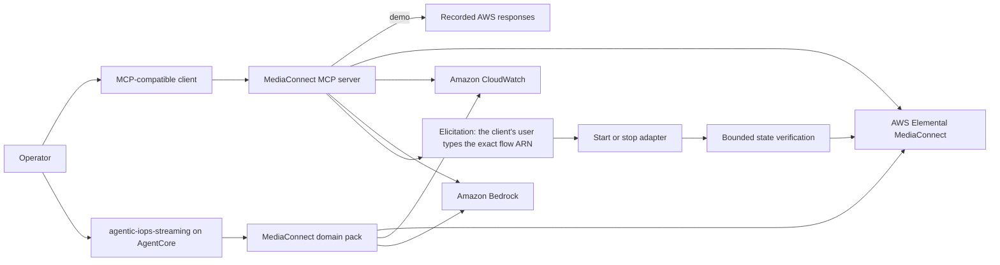

# MediaConnect MCP Server

Investigate live-video transport health, packet loss, connectivity, and visual
evidence from an MCP-compatible assistant.

> [!IMPORTANT]
> This AWS sample is for educational and reference purposes. It requires
> security hardening, testing, and customization before production use.

## Purpose

Use this sample when an operator needs to determine whether an incident begins
in contribution or distribution transport before investigating downstream
encoding and delivery.

The first successful run needs no AWS account. It replays an SRT incident where
the MediaConnect flow remains active and connected while packet loss,
retransmission recovery, and unrecovered packets rise.

## Architecture



The stdio entrypoint and the coordinator's domain pack expose the same typed,
action-named adapters for MediaConnect, CloudWatch, and Bedrock. Workflows
combine their results for issue detection, metric tables, and thumbnail
descriptions.

Read tools are always available. Write tools do not exist unless
`ALLOW_WRITES=true`. When they do, the server enforces one human step itself:
before anything changes, it asks the MCP client's user, through MCP elicitation, to
type the exact flow ARN. The model's tool arguments can't answer that question; a
different ARN, a decline or a cancel changes nothing, and a client that doesn't
support form elicitation, or fails to ask, can't write at all. The adapter then verifies
the final flow state. Your client's own tool-permission prompt, if it has one, comes on
top. **It assumes a trusted client.** The server can check only that the client returned the exact id, not that a person typed it: a client that answers elicitations by itself (or with a model) defeats this step. Keep `ALLOW_WRITES=false` unless you trust the client to show the question to a person.

## Prerequisites

For the fixture demo:

- Python 3.12 or newer. `uv` installs the repository's Python version from
  `.python-version`.
- [`uv`](https://docs.astral.sh/uv/).
- [`just`](https://just.systems/), installed with
  `uv tool install rust-just`.
- An MCP-compatible client, such as Amazon Q CLI, Claude Desktop, Cursor, or
  another client that can launch a stdio server.

For live AWS reads, also provide:

- AWS CLI v2 and configured AWS credentials.
- An AWS region containing at least one MediaConnect flow.
- IAM permission for `mediaconnect:ListFlows`, `mediaconnect:DescribeFlow`,
  `mediaconnect:DescribeFlowSourceMetadata`,
  `mediaconnect:DescribeFlowSourceThumbnail`, `cloudwatch:GetMetricData`, and
  `bedrock:InvokeModel` on the `THUMBNAIL_MODEL_ID` model.
- Access to the model named by `THUMBNAIL_MODEL_ID` when using thumbnail
  analysis.

For optional writes, also provide `mediaconnect:StartFlow` and
`mediaconnect:StopFlow`. Existing MediaConnect flows and their data transfer
can incur AWS charges; this sample does not create those resources.

Check the local tools:

```bash
python3 --version
uv --version
just --version
```

Before live use, check the AWS identity and configured region:

```bash
aws sts get-caller-identity
aws configure get region
```

## Setup and Run

### Run Locally

Clone the repository and enter its root:

```bash
git clone https://github.com/aws-samples/sample-agentic-video-operations.git
cd sample-agentic-video-operations
```

1. Create the one root configuration:

   ```bash
   cp .env.example .env
   ```

2. Install `just`:

   ```bash
   uv tool install rust-just
   ```

3. Start the fixture-backed server:

   ```bash
   DEMO=1 DEMO_SCENARIO=srt_packet_loss just run mediaconnect
   ```

   Raw command:

   ```bash
   DEMO=1 DEMO_SCENARIO=srt_packet_loss ALLOW_WRITES=false uv run \
     --package mediaconnect-mcp-server \
     serve-mediaconnect
   ```

   A stdio MCP server waits silently for a client connection. Stop this smoke
   check with `Ctrl+C`; the client configuration in the next step launches the
   same server.

4. Add the live and demo entries from [`mcp.json`](mcp.json) to your MCP
   client. Replace the repository path with its absolute path:

   ```json
   {
     "mcpServers": {
       "mediaconnect": {
         "command": "uv",
         "args": [
           "run",
           "--directory",
           "/absolute/path/to/sample-agentic-video-operations",
           "--env-file",
           ".env",
           "--package",
           "mediaconnect-mcp-server",
           "serve-mediaconnect"
         ]
       },
       "mediaconnect-demo": {
         "command": "uv",
         "args": [
           "run",
           "--directory",
           "/absolute/path/to/sample-agentic-video-operations",
           "--package",
           "mediaconnect-mcp-server",
           "serve-mediaconnect"
         ],
         "env": {
           "DEMO": "1",
           "DEMO_SCENARIO": "srt_packet_loss",
           "ALLOW_WRITES": "false"
         }
       }
     }
   }
   ```

5. Restart the MCP client and send this known-good request:

   ```text
   Inspect source health for the demo MediaConnect flow. Is the source still
   connected, and what transport evidence explains downstream input loss?
   ```

   Expected result:

   ```text
   The assistant lists or describes demo-contribution, then reads source
   health metrics. It reports that the flow is ACTIVE and SourceConnected
   remains 1 while SourcePacketLossPercent rises from 0.1 to 9.7,
   SourceARQRecovered rises from 2 to 91, and unrecovered packets reach 44.
   The evidence points to upstream SRT packet loss rather than a stopped flow.
   ```

Keep `ALLOW_WRITES=false` for diagnosis. To use `start_flow` and `stop_flow` from your
MCP client, set it to `true` and a private `APPROVAL_SIGNING_KEY` in `.env`, then restart
the client. Every write then asks you, through your MCP client, to type the exact flow
ARN. That needs a client that supports MCP form elicitation (the 2025-06-18
specification or later) and shows the question to you; with any other client the write
tools refuse, and say so. Don't enable writes with a client that answers elicitations by
itself.

### Deploy to AWS

This sample can run locally over MCP stdio or in AWS as a domain pack of the
[agentic-iops-streaming](../agentic-iops-streaming/README.md).

1. Set these values in the root `.env`. Use `MEDIA_DOMAINS=mediaconnect` to
   deploy only this pack, or keep the default to deploy it with MediaLive:

   ```dotenv
   AWS_REGION=us-west-2
   MEDIA_DOMAINS=mediaconnect
   THUMBNAIL_MODEL_ID=us.anthropic.claude-haiku-4-5-20251001-v1:0
   ALLOW_WRITES=false
   DEMO=false
   ```

2. Confirm that the active identity can see flows:

   ```bash
   export AWS_REGION=us-west-2
   aws mediaconnect list-flows \
     --region "$AWS_REGION" \
     --query "Flows[].{Name:Name,State:Status,Arn:FlowArn}"
   ```

3. Deploy agentic-iops-streaming:

   ```bash
   just deploy agentic-iops-streaming
   ```

   Raw command:

   ```bash
   uv run python scripts/manage_agentic_iops_streaming_stack.py deploy
   ```

Keep `ALLOW_WRITES=false` for diagnosis. To opt into start/stop tools, set it
to `true` before deployment. The coordinator pauses every write for an operator
decision and verifies the resulting flow state.

### Verify the Deployment

Ask the deployed agent a known-good question:

```bash
uv run python scripts/invoke_agentic_iops_streaming.py --actor <your-operator-id> \
  "List MediaConnect flows and check source health for one ACTIVE flow over the last hour"
```

Expected result:

```text
The agent emits task_started and tool_called events for list_flows and the source
health tools, then usage_reported and a final_answer with connection, loss,
recovery, bitrate and round-trip evidence. With ALLOW_WRITES=false, start_flow
and stop_flow are not available.
```

## Available Tools

| Tool | Read/write | What it does |
|---|---|---|
| `list_flows` | Read | Lists flows visible in the configured region |
| `describe_flow` | Read | Returns state, source, outputs, and AWS errors for one flow |
| `describe_flow_source_metadata` | Read | Returns transport-stream and NDI source metadata |
| `describe_flow_thumbnail` | Read | Describes the current source thumbnail with Bedrock |
| `analyze_flow_visual_quality` | Read | Samples the source thumbnail over a window (10 frames in 30 s; agentic-iops-streaming uses 8 in 20 s) and scores it: freeze, black, slate, blur and a blockiness **estimate**, plus one vision-model rubric, checked against the flow's content-quality (frozen and black frames) and source-connection metrics. Without thumbnails or a vision verdict the flow is `UNVERIFIED`, never healthy, with the reason; no `THUMBNAIL_MODEL_ID` reads `not_requested`. `frames` 2–20 and `window_seconds` 1–120. Blocks for the whole window |
| `get_flow_health_metrics` | Read | Reads flow transport and TR 101 290 metrics |
| `get_source_health_metrics` | Read | Reads source connection, packet loss, recovery, and merge metrics |
| `get_output_health_metrics` | Read | Reads output connection, packet, and payload metrics |
| `get_media_health_metrics` | Read | Reads source jitter, latency, uptime, and drop metrics |
| `get_content_quality_metrics` | Read | Reads missing-stream, black-frame, freeze, silence, and timecode metrics |
| `get_all_metrics` | Read | Reads all five metric categories |
| `check_flow_issues` | Read | Flags non-zero loss, drops, disconnects, errors, and missing streams |
| `get_metrics_table` | Read | Flattens metric points into chronological rows |
| `start_flow` | Write | Starts one approved flow and verifies `ACTIVE` |
| `stop_flow` | Write | Stops one approved flow and verifies `STANDBY` |

## Teardown

Stop the MCP process with `Ctrl+C`.

The local server creates no AWS infrastructure. Remove the agentic-iops-streaming deployment with:

```bash
just destroy agentic-iops-streaming
```

Raw command:

```bash
uv run python scripts/manage_agentic_iops_streaming_stack.py destroy
```

Do not delete MediaConnect flows merely to clean up this sample; they are
pre-existing operator-owned resources.

If you explicitly enabled writes and changed a flow state during testing,
restore the intended state through another separately approved `start_flow` or
`stop_flow` call. Remove the local `.env` when it is no longer needed because
it may contain the approval signing key.

The agentic-iops-streaming teardown removes its stack and runtime log groups. The CDK bootstrap
ECR repository may retain the image; remove it there if unused. Orphaned AWS
resources can continue to incur cost.

## Known Limitations

- This is an educational sample, not a production-ready operations service.
- The MCP server uses stdio locally; cloud operation uses the shared
  agentic-iops-streaming runtime on AgentCore rather than a dedicated MediaConnect runtime.
- The sample inspects existing MediaConnect resources and does not provision a
  test flow.
- IAM, tenant isolation, audit retention, rate limiting, retries, and
  high-availability behavior require production review.
- Issue detection uses explicit metric-name and threshold rules; it is not a
  complete transport fault classifier.
- Thumbnail descriptions are model-dependent and may vary.
- The `srt_packet_loss` fixture is one representative incident and does not
  reproduce every MediaConnect or CloudWatch behavior.
- Write tools are safe-by-default but still require organization-specific
  authorization, change-management, and rollback controls.
- Metric reads use a maximum seven-day window and five-minute periods.

## Development

Run the MediaConnect tests:

```bash
just test mediaconnect
```

Raw command:

```bash
uv run pytest samples/mediaconnect/tests
```

Run repository lint and formatting checks:

```bash
just lint
```

Raw commands:

```bash
uv run ruff check .
uv run ruff format --check .
```

Keep adapters importable as plain typed functions. The in-process domain pack
and the MCP server both expose them without importing the other's transport.

## Contributing

Read [`AGENTS.md`](../../AGENTS.md) and
[`CONTRIBUTING.md`](../../CONTRIBUTING.md) before opening a pull request.

## Security

Never commit credentials, `.env` files, approval keys, account IDs, ARNs, or
real flow identifiers. Keep writes disabled unless the operator intends to
change an exact flow, and review IAM permissions for least privilege. Report
security issues through the process in
[`CONTRIBUTING.md`](../../CONTRIBUTING.md#security-issue-notifications).

## License

This project is licensed under the MIT No Attribution License. See
[`LICENSE`](../../LICENSE).
