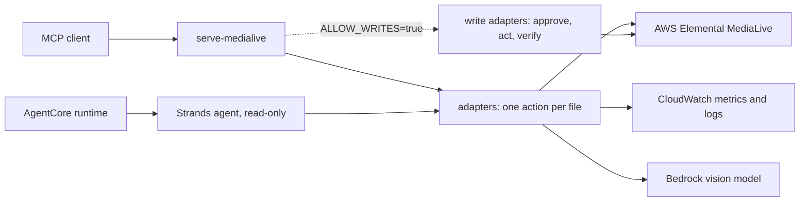

# MediaLive MCP Server

Find out why a live channel is unhealthy (input loss, alerts, dropped frames, bad
output), with evidence from metrics and logs, from any MCP client or AgentCore agent.

> [!IMPORTANT]
> This sample is for educational and reference purposes. It is not production-ready
> without security hardening, testing, and customization for your environment.

## Purpose

This sample is for video operators and developers who run channels on AWS Elemental
MediaLive. Ask about a channel in plain language. The server lists and describes
channels, reads both pipelines' CloudWatch metrics and the channel logs, scores five
health categories, and describes the output thumbnail with a vision model.

On your first run you replay a recorded incident without an AWS account. In it,
pipeline 0 has lost its SRT input, and `check_channel_issues` finds that.

## Architecture



- **Entrypoints** handle transport only:
  - `serve_mcp.py` (MCP stdio);
  - `handle_agentcore_invocation.py` (the Strands agent on AgentCore).
- **Adapters** (`src/medialive_mcp/adapters/`) make one AWS call each and return typed results.
  - `read_channel_metrics` reads every metric for both pipelines in one `GetMetricData` call.
- **Domain rules** (`domain/identify_channel_issues.py`) score the five categories:
  - channel health;
  - input health;
  - output health;
  - media health;
  - content quality.
- **Writes are authorized and verified in code**, not by the prompt:
  - Write tools exist only with `ALLOW_WRITES=true`.
  - Each one needs `confirm_resource_id` equal to the channel id, and your MCP client's tool-approval prompt.
  - The adapter rejects an unsigned or expired approval, sends the change once, then polls until the channel reaches the target state.
- **The Strands agent registers no write tools,** because it has no approval path.

## Prerequisites

- Python 3.12 or newer. `uv` installs it automatically from `.python-version`.
- [`uv`](https://docs.astral.sh/uv/) and [`just`](https://just.systems/) (`uv tool install rust-just`).
- An MCP client, such as Claude Code, Kiro or Amazon Q Developer CLI.
- **For AWS-backed use:**
  - AWS credentials with the read permissions listed under Deploy to AWS;
  - a MediaLive channel;
  - access to the thumbnail model in `THUMBNAIL_MODEL_ID`.
- **For deployment:**
  - Docker;
  - Node.js 20 or newer;
  - a bootstrapped CDK environment (`just doctor` checks it).

```bash
just doctor
```

## Setup and Run

### Run Locally

1. From the repository root, create the configuration and add this sample's variables
   from `samples/medialive/.env.example`:

   ```bash
   cp .env.example .env
   ```

2. Replay the recorded incident (no AWS account needed):

   ```bash
   DEMO=1 just run medialive
   ```

   Raw command: `DEMO=1 uv run --package medialive-mcp-server serve-medialive`

3. Or connect an MCP client. Add the entries from [`mcp.json`](mcp.json) to the client's
   configuration, and replace `/absolute/path/to/sample-agentic-video-operations` with
   your clone's path.
   - `medialive-demo` replays fixtures.
   - `medialive` uses your root `.env` and real AWS credentials.

   ```json
   {
     "mcpServers": {
       "medialive": {
         "command": "uv",
         "args": [
           "run",
           "--directory",
           "/absolute/path/to/sample-agentic-video-operations",
           "--env-file",
           ".env",
           "--package",
           "medialive-mcp-server",
           "serve-medialive"
         ]
       },
       "medialive-demo": {
         "command": "uv",
         "args": [
           "run",
           "--directory",
           "/absolute/path/to/sample-agentic-video-operations",
           "--package",
           "medialive-mcp-server",
           "serve-medialive"
         ],
         "env": {
           "DEMO": "1",
           "DEMO_SCENARIO": "input_loss",
           "ALLOW_WRITES": "false"
         }
       }
     }
   }
   ```

4. Send a known-good request:

   ```text
   Check channel 1234567 for issues in the last hour.
   ```

   Expected result with `medialive-demo`: the assistant calls `check_channel_issues` and
   reports `InputLossSeconds` and `ActiveAlerts` on pipeline 0, with pipeline 1 healthy.
   The log events say "no SRT packets received".

### Deploy to AWS

This sample's CDK app deploys its read-only Strands agent. A later release replaces that
agent with the media ops hub, which loads MediaLive as one of its domains. Until then,
deploy from the repository root, loading the models and region from your root `.env`:

```bash
set -a; source .env; set +a   # exports AGENT_MODEL_ID, THUMBNAIL_MODEL_ID and AWS_REGION
cd samples/medialive/cdk
npm ci
npx cdk deploy \
  --parameters BedrockModelId="$AGENT_MODEL_ID" \
  --parameters ThumbnailModelId="$THUMBNAIL_MODEL_ID" \
  --parameters DefaultChannelId="<your channel id>"
```

- **What it deploys:** the read-only Strands agent on AgentCore Runtime, its AgentCore Memory, and an IAM role.
- **Billing:** AgentCore Runtime, Memory and Bedrock usage are billable.
- **Image build:** the container image is built from the repository root (`samples/medialive/Dockerfile`).
- **Read permissions** used by the tools:
  - `medialive:ListChannels`, `DescribeChannel`, `DescribeSchedule`, `DescribeThumbnails`
  - `cloudwatch:GetMetricData`
  - `logs:FilterLogEvents`
  - `bedrock:InvokeModel` (also used by the Converse API)
- **Write permissions**, needed only for the MCP write tools: `medialive:StartChannel`, `StopChannel`, `BatchUpdateSchedule`.

### Verify the Deployment

Invoke the deployed agent with a known-good request, in the same shell (so `AWS_REGION`
is still set). Use the `AgentRuntimeArn` stack output:

```bash
export AGENT_RUNTIME_ARN="<AgentRuntimeArn output>"
aws bedrock-agentcore invoke-agent-runtime \
  --agent-runtime-arn "$AGENT_RUNTIME_ARN" \
  --runtime-session-id "$(uuidgen)-$(uuidgen)" \
  --payload "$(printf '%s' '{"prompt":"List my MediaLive channels"}' | base64)" \
  --region "$AWS_REGION" \
  output.json && cat output.json
```

Expected result: a `response` that lists your channels with their state.

## Available Tools

| Tool | Read/write | What it does |
|---|---|---|
| `list_channels` | Read | Channels with id, name, state and running pipelines |
| `describe_channel` | Read | State, input attachments, active input per pipeline |
| `read_channel_metrics` | Read | 5-minute averages per pipeline; optional `category` |
| `read_channel_logs` | Read | Most recent channel log events |
| `check_channel_issues` | Read | Five category scores and every failing metric rule |
| `read_metrics_table` | Read | Key metrics as rows for charts |
| `describe_schedule` | Read | Scheduled input switches, SCTE-35, pauses |
| `describe_channel_thumbnail` | Read | Vision-model description of a pipeline's thumbnail |
| `start_channel`, `stop_channel` | Write | Change channel state, then verify RUNNING / IDLE |
| `switch_channel_input` | Write | Switch now, then verify every pipeline's active input |
| `create_input_switch_action`, `create_scte35_action`, `create_pause_action`, `create_unpause_action` | Write | Add a timed action, then verify it is scheduled |
| `delete_schedule_action` | Write | Remove an action, then verify it is gone |

The Strands agent groups the read tools into four composite tools:
- `channel_management`
- `channel_monitoring`
- `schedule_management`
- `channel_health_monitoring`

## Teardown

Stop a local MCP server with `Ctrl+C`. Destroy the deployment:

```bash
cd samples/medialive/cdk
npx cdk destroy MediaLiveAgentCoreStack
```

**After destroying, check for:**
- the ECR image pushed by the CDK asset;
- the `/aws/bedrock-agentcore/runtimes/*` log groups.

Orphaned resources can keep incurring cost.

## Known Limitations

- The responses in `fixtures/input_loss` are synthetic, shaped like the AWS responses. They are not recordings.
- The Strands agent is read-only. It recommends an input switch but cannot apply one.
- `code_mode` (Strands agent) only exists with `ENABLE_CODE_MODE=true`. It runs model-written Python in the agent process, so enable it only in a sandbox you trust.
- `DroppedFrames` and `SvqTime` use other dimensions in CloudWatch, so they may show no data.
- The CDK role uses wildcard resources and includes write permissions the read-only agent doesn't use. Scope both before any production use.
- `tests/unit`, `tests/local` and `tests/remote` hold the previous layout's tests and aren't run. `just test medialive` runs `tests/scenarios`, which covers the current package.
- Model output is nondeterministic. Safety comes from the write adapters, not from the prompt.

## Development

```bash
just test medialive
just lint
```

Add a tool as one adapter file under `src/medialive_mcp/adapters/<system>/`, returning a
typed result. Register it in `entrypoints/serve_mcp.py`. Write tools take an
`ApprovedAction` and verify the result (see `docs/write_safe_tools.md`).

## Contributing

Read the root [`AGENTS.md`](../../AGENTS.md) and
[`CONTRIBUTING.md`](../../CONTRIBUTING.md).

## Security

Never commit credentials, `.env` files, account ids, ARNs or real channel ids. Report
security issues through
[`CONTRIBUTING.md`](../../CONTRIBUTING.md#security-issue-notifications).

## License

This project is licensed under the MIT No Attribution License. See
[`LICENSE`](../../LICENSE).
