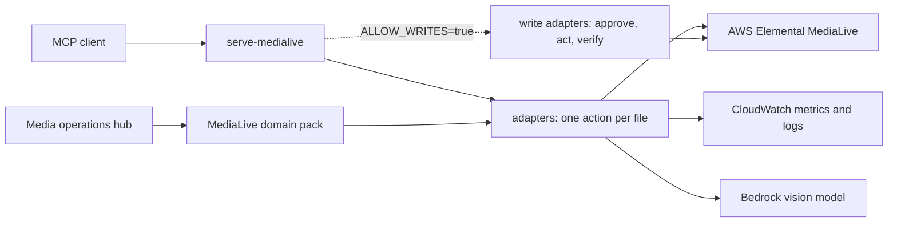

# MediaLive MCP Server

Find out why a live channel is unhealthy (input loss, alerts, dropped frames, bad
output), with evidence from metrics and logs, from any MCP client or AgentCore agent.

> [!IMPORTANT]
> This sample is for educational and reference purposes. It is not production-ready
> without security hardening, testing, and customization for your environment.

## Purpose

This sample is for video operators and developers who run channels on AWS Elemental
MediaLive. Ask about a channel in plain language. The server lists and describes
channels, reads both pipelines' CloudWatch metrics and the channel logs, scores five
health categories, and describes the output thumbnail with a vision model.

On your first run you replay a recorded incident without an AWS account. In it,
pipeline 0 has lost its SRT input, and `check_channel_issues` finds that.

## Architecture



- **Entrypoints** handle transport only: `serve_mcp.py` serves MCP over stdio.
- **AgentCore deployment** comes from the media operations hub, which loads this
  sample as an in-process domain pack.
- **Adapters** (`src/medialive_mcp/adapters/`) make one AWS call each and return typed results.
  - `read_channel_metrics` reads every metric for both pipelines in one `GetMetricData` call.
- **Domain rules** (`domain/identify_channel_issues.py`) score the five categories:
  - channel health;
  - input health;
  - output health;
  - media health;
  - content quality.
- **Writes are authorized and verified in code**, not by the prompt:
  - Write tools exist only with `ALLOW_WRITES=true`.
  - Before any change, the server asks your MCP client's user, through MCP elicitation, to type the exact channel id, and shows the action and every parameter. The model's arguments can't answer: another id, a decline or a cancel changes nothing, and a client without elicitation support can't write at all.
  - **It assumes a trusted client.** The server can check only that the client returned the exact id, not that a person typed it: a client that answers elicitations by itself (or with a model) defeats this step. Keep `ALLOW_WRITES=false` unless you trust the client to show the question to a person.
  - The adapter rejects an unsigned or expired approval, sends the change once, then polls until the channel reaches the target state.
- **The hub registers writes only when enabled,** and uses its signed approval
  flow before calling the same verified write adapters.

## Prerequisites

- Python 3.12 or newer. `uv` installs it automatically from `.python-version`.
- [`uv`](https://docs.astral.sh/uv/) and [`just`](https://just.systems/) (`uv tool install rust-just`).
- An MCP client, such as Claude Code, Kiro or Amazon Q Developer CLI.
- **For AWS-backed use:**
  - AWS credentials with the read permissions listed under Deploy to AWS;
  - a MediaLive channel;
  - access to the thumbnail model in `THUMBNAIL_MODEL_ID`.
- **For deployment:**
  - Docker;
  - Node.js 20 or newer;
  - a bootstrapped CDK environment (`just doctor` checks it).

```bash
just doctor
```

## Setup and Run

### Run Locally

1. From the repository root, create the one shared configuration:

   ```bash
   cp .env.example .env
   ```

   For live defaults, uncomment the MediaLive section in that root file.

2. Replay the recorded incident (no AWS account needed):

   ```bash
   DEMO=1 just run medialive
   ```

   Raw command: `DEMO=1 uv run --package medialive-mcp-server serve-medialive`

3. Or connect an MCP client. Add the entries from [`mcp.json`](mcp.json) to the client's
   configuration, and replace `/absolute/path/to/sample-agentic-video-operations` with
   your clone's path.
   - `medialive-demo` replays fixtures.
   - `medialive` uses your root `.env` and real AWS credentials.

   ```json
   {
     "mcpServers": {
       "medialive": {
         "command": "uv",
         "args": [
           "run",
           "--directory",
           "/absolute/path/to/sample-agentic-video-operations",
           "--env-file",
           ".env",
           "--package",
           "medialive-mcp-server",
           "serve-medialive"
         ]
       },
       "medialive-demo": {
         "command": "uv",
         "args": [
           "run",
           "--directory",
           "/absolute/path/to/sample-agentic-video-operations",
           "--package",
           "medialive-mcp-server",
           "serve-medialive"
         ],
         "env": {
           "DEMO": "1",
           "DEMO_SCENARIO": "input_loss",
           "ALLOW_WRITES": "false"
         }
       }
     }
   }
   ```

4. Send a known-good request:

   ```text
   Check channel 1234567 for issues in the last hour.
   ```

   Expected result with `medialive-demo`: the assistant calls `check_channel_issues` and
   reports `InputLossSeconds` and `ActiveAlerts` on pipeline 0, with pipeline 1 healthy.
   The log events say "no SRT packets received".

### Deploy to AWS

MediaLive deploys as a domain pack of the media ops hub (`samples/hub/`): one AgentCore
runtime that loads the packs named in `MEDIA_DOMAINS`. To deploy MediaLive alone, set
`MEDIA_DOMAINS=medialive` in the root `.env`, then:

```bash
just deploy hub
```

Raw command:

```bash
uv run python scripts/manage_hub_stack.py deploy
```

- **What it deploys:** the hub on AgentCore Runtime, its AgentCore Memory, one Secrets
  Manager secret (the approval signing key) and an IAM role.
- **Billing:** AgentCore Runtime, Memory, Secrets Manager and Bedrock usage are billable.
- **Permissions** come from [`iam_permissions.json`](iam_permissions.json): every `read`
  statement, and the `write` statements only with `ALLOW_WRITES=true` in the root `.env`.
- **CDK bootstrap:** once per account in the `AWS_REGION` of your root `.env`
  (`just doctor aws` checks it).

### Verify the Deployment

Ask the deployed hub a known-good question. The hub refuses a request without an actor,
which this script sends for you:

```bash
uv run python scripts/invoke_hub.py --actor <your-operator-id> "List my MediaLive channels"
```

Expected result: `task_started` and `tool_called` (`list_channels`) events, then a
`final_answer` that lists your channels with their state.

## Available Tools

| Tool | Read/write | What it does |
|---|---|---|
| `list_channels` | Read | Channels with id, name, state and running pipelines |
| `describe_channel` | Read | State, input attachments, active input per pipeline |
| `read_channel_metrics` | Read | 5-minute values per pipeline (and output group), each with its recommended statistic; optional `category` |
| `read_channel_logs` | Read | Most recent channel log events |
| `check_channel_issues` | Read | Five category scores and every failing metric rule |
| `read_metrics_table` | Read | Key metrics as rows for charts |
| `describe_schedule` | Read | Scheduled input switches, SCTE-35, pauses |
| `describe_channel_thumbnail` | Read | Vision-model description of a pipeline's thumbnail |
| `analyze_channel_visual_quality` | Read | Samples thumbnails over a window (10 frames in 30 s; the hub uses 8 in 20 s) and scores each pipeline: freeze, black, slate, blur and a blockiness **estimate**, plus one vision-model rubric, then checks each finding against the encoder's MQCS freeze and black, fill-frame and input-loss signals. Every pipeline is scored and the channel status is the worst one's; `pipeline_id` only narrows the list returned. Without thumbnails or a vision verdict a pipeline is `UNVERIFIED`, never healthy; no `THUMBNAIL_MODEL_ID` reads `not_requested`. `frames` 2–20 and `window_seconds` 1–120. Blocks for the whole window |
| `start_channel`, `stop_channel` | Write | Change channel state, then verify RUNNING / IDLE |
| `switch_channel_input` | Write | Switch now, then verify every pipeline's active input |
| `create_input_switch_action`, `create_scte35_action`, `create_pause_action`, `create_unpause_action` | Write | Add a timed action, then verify it is scheduled |
| `delete_schedule_action` | Write | Remove an action, then verify it is gone |

## Teardown

Stop a local MCP server with `Ctrl+C`. Remove the hub deployment:

```bash
just destroy hub
```

Raw command:

```bash
uv run python scripts/manage_hub_stack.py destroy
```

It deletes the stack and the hub's runtime log groups, and prints exactly what remains if
a step fails. The CDK bootstrap ECR repository may keep the hub image; remove it there if
unused. Orphaned resources can keep incurring cost.

## Known Limitations

- The responses in `fixtures/input_loss` are synthetic, shaped like the AWS responses. They are not recordings.
- `DroppedFrames` and `SvqTime` use other dimensions in CloudWatch, so they may show no data.
- Model output is nondeterministic. Safety comes from the write adapters, not from the prompt.

## Development

```bash
just test medialive
just lint
```

Add a tool as one adapter file under `src/medialive_mcp/adapters/<system>/`, returning a
typed result. Expose a read tool in `tool_surface/create_read_tools.py`, which serves both
MCP and the hub domain pack. Write tools take an `ApprovedAction` and verify the result
(see `docs/write_safe_tools.md`).

## Contributing

Read the root [`AGENTS.md`](../../AGENTS.md) and
[`CONTRIBUTING.md`](../../CONTRIBUTING.md).

## Security

Never commit credentials, `.env` files, account ids, ARNs or real channel ids. Report
security issues through
[`CONTRIBUTING.md`](../../CONTRIBUTING.md#security-issue-notifications).

## License

This project is licensed under the MIT No Attribution License. See
[`LICENSE`](../../LICENSE).
